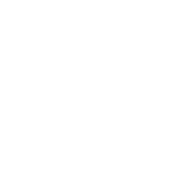

## Quick and Dirty Introduction to Genetic Programming

Evolution only needs three things to occur: replication, variation, and
selection.
[It doesn't need "life"](https://royalsocietypublishing.org/doi/abs/10.1098/rspb.1979.0077) [(Archived)](https://web.archive.org/web/20220106/https://royalsocietypublishing.org/doi/abs/10.1098/rspb.1979.0077),
and isn't even fussy about any particular properties of the matter involved. Programs, in
fact, are exemplary candidates for evolution. It's possible -- in fact, it's
easy -- to evolve programs that are well-adapted to particular tasks, that find
optimal solutions to problems, that fuzz out leaks and holes in software, that
discover and exploit vulnerabilities, etc. The craft of doing so is called
"genetic programming".

Classically, what you need to implement genetic programming is this: some way of
selecting, out of a population of (intially random) programs, candidates for
reproduction, and one or more "variation operators", which carry out that
reproduction by mutating or recombining those candidates in a controlled but
stochastic fashion. (There are various features that a well-chosen variation
operator _should_ have, but that is, itself, a live field of research, and
a topic for another post.)

Selection is traditionally performed with reference to the "fitness" of a
specimen, which requires you to quantify how close it comes to solving the
problem you're interested in. For classification problems, this could be tied to
accuracy, or detection rate, or whatever. For optimisation problems, it could be
tied to efficiency. Coming up with a good selection method is usually the key to
unravelling the entire problem. With that in hand, almost everything else falls
into place.

Once it's up and running, an evolutionary algorithm implements a form of
"machine learning", or even intelligence. There's something wonderful about
this. It's "Intelligent Design" turned on its head: instead of inferring an
_intelligent designer_ from the complexity and problem-solving capacities of life,
we abstract, from evolutionary theory, an algorithmic description of how those
life-forms came to exist, and use it _to design intelligence!_ 

## Coevolution and Parasitism

Now, instead of measuring the evolving population against some static, a priori
measure of fitness, it's possible to implement the selective pressures as
evolving populations in their own right. This is the aim of _competitive coevolutionary algorithms_,
where two or more populations exert selection pressure on one another, in the 
absence of any external measure. It's common to compare this dynamic to the
relationship relation between host and parasite, or predator and prey. The
parasite poses problems to the host, and itself has to adapt to this task. The
host tries to solve these problems in return. The predator "instructs" its prey,
and the prey returns the favour.

There's a few ways this can go. The two populations can lock into an "arms
race", each adaptation spurring a counter-adaptation on the part of the
opponent. (This is, generally speaking, the ideal outcome for the engineer of
the process, who wants to do everything they can to accelerate the process.)
But it's also possible for the two populations to _collude_, learning to pose as
little challenge as possible to one another, settling into a sort of oligarchical
mediocrity. An especially common outcome, however, is for the two populations to
simply _disengage_.

On this topic, it was a paper by John Cartlidge and Seth Bullock, entitled
[Combating Coevolutionary Disengagement by Reducing Parasite Virulence](/data/parasite-gp.pdf)
that initially captured my imagination. "Coevolutionary disengagement", they begin, 

> occurs when one advantaged population
> outperforms another to the extent that conspecifics become indistinguishable from
> one another interms of fitness. At such times, coevolving populations become
> decoupled, and se-lection acts indiscriminately causing the system to drift,
> often with deleterious results

The word "outperforms" can be a bit misleading, here. It's not that one
population is doing _better_ than the other, in any objectively meaningful
sense. Only that it has lost any means of telling its counterparts apart. A
teacher whose tests have become so impossibly difficult that all of her students
uniformly fail, for example, is "outperforming" the students, in this sense --
but in this sense alone.

Or to take another example, and one you can experiment with
a bit more freely, imagine
[(or implement)](https://github.com/oblivia-simplex/genpong)
two populations of pong players -- one of which always
plays the right side of the table, and one of which always plays the left. Let's
say that the fitness function is something like "the number of games won".
Players that win against the opposing population go on to breed (at least
probabilistically) and ones that lose, don't. Now, suppose we've reached a point
where the left population defeats every single right-side player with equal (and
high) probability. At this point, whatever selective pressure that the left side
imposed on the right is lost -- and vice-versa. The two populations are no
longer able to distinguish between one another's members, and, as a result, the
fitness landscapes that the two populations find themselves upon have been
flattened to a plane. Variation continues to occur, but it is now a purely
stochastic process, a random walk. With selection no longer playing a role,
[genetic drift](https://evolution.berkeley.edu/evolibrary/article/evo_24) comes
to dominate the evolutionary process. Adaptation has stopped, and any
"intelligence" that the system might have exhibited gives way to a kind of
free-floating delirium.

## The Discourse of Angels

It's interesting to look at the relationship between academic philosophy and its
outside through this model: entire discourses -- or "discursive populations" --
that are no longer sensitive to any selective pressures from the outside.
Or none, at least, whose selective criteria are relevant to philosophy's own
"fitness". The sciences, from academic philosophy's perspective, have coalesced
into an opaque monolithic block, whose harmful radiation is warded off by cries
of "scientism". Political realities, for their part, are smoothed into
a small set of opaque, featureless banners. And so on. 

Of course, these discourses continue to mutate, and _some_ sort of selection 
still occurs, in the blind caprice of committees -- mechanisms that discursive
trends can certainly game, but not really _as_ philosophy. "Memetic drift"
settles in -- a random walk through academic memespace, whose paths we
can afterwards describe only in terms of fashion.

This might be an interesting way of framing political disengagement, too. I'm
not talking about apathy or listlessness here. Disengagement, in this sense, can
be passionate. It can even be romanticised -- an angelic posture
so intense, so virulent, that no adversary can measure up to it.
[Everything is equally unacceptable.](https://www.mcgilldaily.com/2014/11/everything-problematic/)
A parasite that, for all its virulence, is no longer able to steer the
evolution of its host, in any relevant way, is ill-suited for politics, a craft
where your instrument is your adversary.

If disengagement is the Scylla, collusion's the Charybdis -- a situation where
the selective pressure each population exerts on the other, rather than being
impossibly hardened, is _softened_ to the point of insignificance. The ultimate
effect on the process is the same: both collusion and disengagement amount to a
surrender to drift. Complacent apathy and holy radicalism mirror each other,
here. Any chance of sculpting the adversary's political memeplex is lost, along
with any chance of adapting to their tactics. All that's left is a sort of
delirium, steered only by the vagaries of the attention economy.

---

# Afterthoughts 

---

## Reservations

It should be underscored that this is a quick and dirty model. Its 
application is useful, in some cases, as a thought experiment, but
it makes no pretension to sufficiency in describing political or
institutional dynamics. On no account should it be taken as given
that an "evolutionary arms race" is the dynamic towards which every
adversarial situation should expire. There are many reasons to avoid
this sort of thing.
[There are cases](http://www.bbc.co.uk/guides/zxsfyrd), for example,
where "collusion" is an entirely desirable outcome -- for the populations
involved, if not for the powers deploying them.

## Drift

I should write something longer about "drift", at some point. There's
a certain context-specificity at play, which isn't really remarked upon,
when I say, for example, that the abandonment of a political engagement
to memetic drift will leave it to be "steered only by the vagaries of
the attention economy". Of course, the attention economy plays a selective
game of its own, and brings a very definite fitness function to bear
on the populations it governs. "Drift", here, is only drift, as opposed
to selection, relative to a _particular_ fitness landscape. Is this
the case for all cases of drift? It would depend, I suppose, on how
tractable the fallback fitness landscape is -- to what extent are the
selective pressures it exerts _adaptable_, and to what extent are they
endurable only as noise? 

