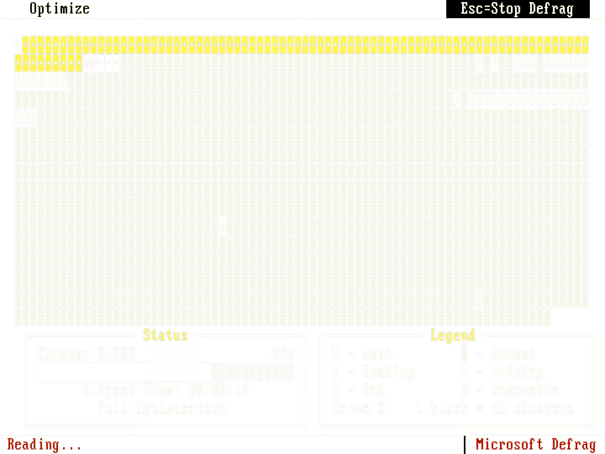
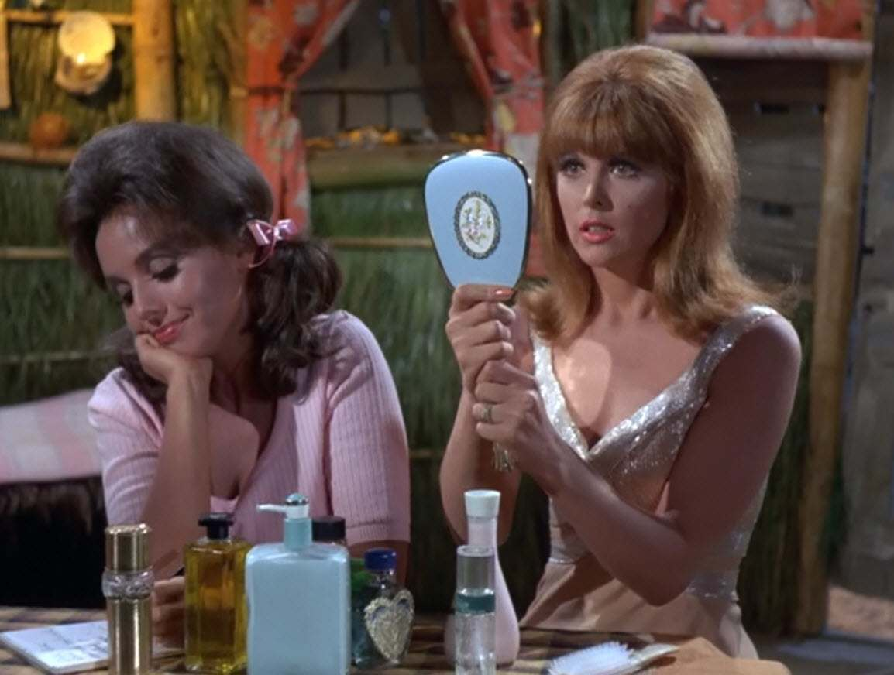
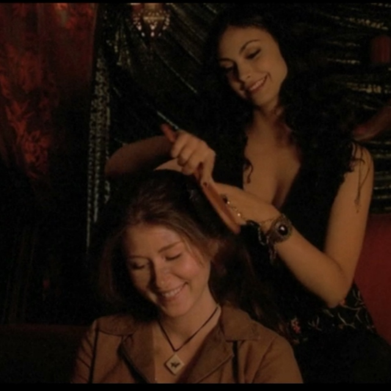

After a sincerely ambitious beginning, this blog seems to have hit a fallow
stretch. This isn't that surprising -- most of what I do, I do in fits and
starts. But it was a little disappointing. I was busy and all that, of course,
but I always am, and was when I started this blog, so I'm not going to pin the
blame on that. It could have been entirely possible for me, I think, to
discipline myself to 
[write in stolen moments](/posts/lerman-whore_for_capitalism.md),
like Lindsay put it. One pretty significant obstacle is just that I haven't quite
gotten used to the idea of writing bloggishly -- which is somewhere between a
conversation and a short paper, I suppose. I think I've been erring on the side
of writing essayistically, holding myself up to (disavowed?) academic
standards without having an academically allocated schedule that would let me
properly satisfy them.



It's funny, because there definitely _are_ media, or genres, where I feel
completely at ease in shooting from the hip -- it's what I really enjoy about
giving interviews, for example, or conducting lectures and seminars, which I've
always almost entirely improvised. I want to try to bring that here, and write
with a bit more dedication and a bit less worry, I suppose.


I figure that a good way to get things moving again would just be to go through
the dozens of half-finished and half-started drafts that I have, sitting in 
~/src/feral_machines/content/posts/scratch, and give any that aren't completely hopeless
a sentence or a paragraph (or several) in the sun, and move on. So, here it goes.


---

# Table of Contents

---


1. [Lack and Leak](#lack)
2. [Weird Machines and Eerie Algorithms](#weird)
13. [The Lure of Triviality](#triviality)
3. [Writing with GPT-2](#gpt-2)
4. [The Punctum Next Door](#punctum)
5. [Gender Fatigue](#fatigue)
6. [The Real Ethics of Computer Science](#ethics-of-cs)
7. [Metalanguage and Metacomedy](#metacomedy)
8. [Types of Obscurity](#obscurity)
9. [drone.c](#drone)
10. [Hello, Inspector](#homophone)
11. [Modularity in Philosophy](#modularity)
12. ['Recursivity'](#recursivity)
14. [Self-Identification](#self-id)
15. [The Eight Root Statements of the Tractatus Logico-Philosophicus as Completed by GPT-2](#eighth-statement)
16. [Epilogue](#epilogue)


---

# Fragments

---

<a name="lack"></a>

## Lack and Leak

---


Over on the
[&&&](https://tripleampersand.org/can-machine-lack-lacanian-computation) blog,
Valentin Golev takes a couple of stabs at modeling the Lacanian concept of lack
-- specifically, that of a "lack in the Other", which is structurally critical
to the formation of subjectivity, in the context of Lacanian psychoanalysis --
in the domain of computation. I didn't find it very compelling, on the whole,
but there was one interesting moment in there, where _lack_ is essentially
understood in terms that amount to _a leak in the abstraction layer called 'the
Other'_. It's tempting to climb back up the wick of Golev's analogy, and see how
far we can get, recasting psychoanalytic theory in computational, and
specifically information-security oriented terms. Trauma as a 'weird state'?
Symptoms as side-channels? Pathologies as weird machines? A long time ago, I
remember seeing someone on twitter (I think her handle was 'ʞ'?) tweet
```
s/attack surface/erogenous zone/
```
which would be a fascinating place for this to wind up. 

While mulling this over, I stumbled across a chapter in John Johnston's
[The Allure of Machinic Life](https://mitpress.mit.edu/books/allure-machinic-life)
which detailed the use that Lacan himself had made of automata theory, at times
(circa Seminar II) modeling the "symbolic order" in terms of finite state machines
-- the same formalisms that 
[Halvar Flake uses](https://ieeexplore.ieee.org/stamp/stamp.jsp?tp=&arnumber=8226852)
uses to codify the general theory of weird machines and exploitation, so there might
be better means than I expected for establishing some sort of correspondence between
the two domains. 
  
---

<a name="weird"></a>

## Weird Machines and Eerie Algorithms

---


The are probably less than ten people in the world who have asked themselves, 
"ok, what relation does the 'weird' in 'weird machines' have with the 'weird'
Mark talks about in 
[The Weird and the Eerie](https://repeaterbooks.com/product/the-weird-and-the-eerie/)",
but I bet each of those ten people ask themselves this on a pretty regular basis. 
So I had the idea of writing a post on the topic, maybe with the additional conceit
of comparing and contrasting two modes of fascination with the strangeness of
computation: I want to write something about how _weird machines_ operate libidinally,
or aesthetically, in the "hacker spirit" -- how they fascinate and become objects
of desire. And I'd also like to write something about the way in which machine learning
algorithms have gripped the public imagination -- especially the imagination of those
for whom the algorithms themselves are an inscrutable black box, those who speak of
"algorithms" in hushed tones, but who couldn't implement a FizzBuzz to save their
mother's life. But maybe also the imaginations of those who work day and night in
machine learning. I've been kicking around the idea that it might be interesting to 
try to cast these technological affects, or genres of technological discourse, 
in terms of K-Punk's conceptual distinction between the weird and the eerie. See if
that holds any water.

---

<a name="triviality"></a>

## The Lure of Triviality

---


Every now and then, I'm reminded of something I must have read (or heard?)
somewhere, concerning the use of tautologies, or near tautologies, in political
rhetoric. For years, I've had some vague sense that I'd read something
*extremely illuminating* on the subject... somewhere. I've never been able to
remember the source, itself, though.  And, come to think of it, my memory of what
that source had actually *said* has faded over the years as well, so I might as
well take a stab at a clean room reconstruction of the topic.

What I have in mind, here, specifically are "trivially true" statements
transformed into political slogans. By "trivially true", I mean to include
both statements that, at least on their surface, are clothed in the syntactic
form of a tautology, as well as statements that make a show of cleaving so
closely to common knowledge as to convey no new information at all
-- slogans that, for all intents and purposes, seem semantically vacuous.

The question I want to ask, then, is just: What's the point? What political
function is achieved by trafficking in "semantically vacuous" slogans?


Now, my reasons for seeing things this way might be an effect of
my rather partisan salience filters, but it seems to me that the
discursive strategy I'm talking about is *principally* wielded by
the Right, and by its reactionary, populist tail, in particular

A few examples that come to mind are:

1. [Men aren't women](https://www.rt.com/news/444189-twitter-man-woman-ban-pc/) -- 
a slogan glibly employed by TERFs and other anti-trans agitators.
1. [Boys will be boys](https://www.pbs.org/newshour/science/why-boys-will-be-boys-is-an-unscientific-excuse-for-assault) -- 
when used to dismiss concerns about sexual violence.
1. [All lives matter](https://en.wikipedia.org/wiki/All_Lives_Matter) -- 
the popular retort by which white supremacists (be they tacit or explicit) most frequently dismiss the eponymous battle cry of the Black Lives Matter movement.
1. [It's okay to be white](https://en.wikipedia.org/wiki/It%27s_OK_to_be_white) --
the slogan of choice in a recent white supremacist postering campaign.
1. [La France aux Français](https://www.theglobeandmail.com/news/world/rise-of-marine-le-pen-how-the-far-right-leader-became-a-contender-in-france/article34752498/) -- a
[perennial](https://www.persee.fr/doc/polit_0032-342x_1993_num_58_3_6289_t1_0810_0000_2) 
rallying cry of French nationalists and xenophobes, whose triviality hinges on
concealing the difference between "those who live in France" and "the French",
but whose virulence depends on exploding it.


These aren't 
[scissor statements](https://slatestarcodex.com/2018/10/30/sort-by-controversial/),
in Scott Alexander's sense -- statements that sow discord by striking one group
as *profoundly, viscerally wrong* and another (which will thereby be christened
its outgroup) as *unquestionably correct*. These statements are deliberately
void of any genuine locus of disagreement, at least when taken literally. They
are intended, after all, to seem "trivially true".

As polemical slogans, however, their explicit intent is divisive. How can a
statement whose literal content is, if not outright empty, utterly
uncontroversial, be used in this way?

Both the proponents and adversaries of these slogans know full well that their
real content has been studiously drained from the words themselves, only
to be held, knowingly, in a contextual reserve. Neither immediate party to
the conflict mistakes the semantically hollow flasks that become the slogan's
literal form for its hidden partisan content.

Crucially, though, there *is* an audience who will, by design, read these
slogans as "trivially true", and who are, in virtue of that fact, their target
market: those outside the immediate conflict, the bystanders and "normies" --
who I suppose we could call the "side-group" of the attack, to distinguish them
from its ingroup and outgroup.

What does this audience see? They see one group trying to defend basic,
undeniable truths and common sense, excruciatingly modest in actual content, and
another objecting hysterically, grinding "logic" and "basic common sense" into
dust, telling the audience that they too are culpable should they believe such
pernicious messages as "men aren't women", that "all lives matter", or that it's
even so much as "okay" to be *white*.

I. Rohl develops this line of argument convincingly in her Medium post, 
[Put in Some Fucking Effort](https://medium.com/@i_rohl/put-in-some-fucking-effort-c2bf28f25df2),
putting their finger on the manner in which _situating these slogans in a debate_,
itself, is sufficient to infuse them with some of their otherwise absent content:

> In particular, uttering a sentence in response to what someone else has said
> will suggest that one thinks the content of one’s utterance relevant to what
> came before, and so will insinuate whatever auxiliary assumptions would be
> needed to make it relevant. If the structure of the conversation sets up an
> utterance as a refutation or counter-point, the utterance will convey that one
> thinks that it is at odds with with the commitments of one’s interlocutors.
> These considerations allow bad actors to make an utterance that clearly
> communicates hateful or objectionable content, and then use literal paraphrase
> and decontextualization to present themselves as wronged parties condemned for
> defending innocuous or demonstrably true positions. 

The article goes on to present an excellent dissection of how this strategy
is used in TERF discourse, with an illuminating detour analysing its analogue in
the use of the "All Lives Matter" slogan.


Does an analogous strategem have a place on the Left, or is this a strictly
Rightist form of sophistry? (And, if the latter, is this for essential or
accidental reasons?)

An analog that *does* leap to mind is: 

- [trans women are women](https://www.theroot.com/trans-women-are-women-this-isn-t-a-debate-1793202635)

which sort of logically _resembles_ "men aren't women" (which looks
like its reactionary counterpart), and which has the syntactic form of a
tautology, as much as "red apples are apples" does. But I think that the analogy
is ultimately superficial. Those who assert this statement generally *do not*
expect immediate, trivial assent outside of a certain ingroup. 

When Leftists elect to cast their slogans in the _style_ of a tautology, or
an argument from definition, it's typically the definition _itself_ that's
loaded with polemical charge. The move being made here is less an appeal to
an established definition (be it of "woman", of "racism", or whatever), than
a succinct call to _recast_ the definition at stake.

This is markedly different from the right-populist, or reactionary, tactic,
which holds slogan's charge in connotative reserve. The reactionary's audience
is not expected to _debate_ whether, in fact, men are actually women 
(though they may well dispute the _implicit_ premise that trans women are
actually men!), or whether all human lives matter, or whether it's okay to be
white, or whether boys will be what they are.

It's unsurprising that the populist kneejerk against this slogan has, itself,
a way of adopting a tautological form, as it does in the mouth of Chimamanda
Ngozi Adichie, around the 3-minute mark of 
[this interview](https://www.channel4.com/news/chimamanda-ngozi-adichie-on-feminism):

> so, when people talk about, you know, 'are transwomen _women_?', my feeling is:
> transwomen are transwomen


The tactic I'm speaking about, here, then, appears to bear an essential
connection to reactionary -- specifically, right-populist -- discourse.
Its charm lies in its appeal to "the way things just _are_", to the 
simple "[facts of the matter](https://thelastinstance.com/posts/facts_are_lazy_and_facts_are_late/)", to "common sense" or "simple logic" -- to the obvious, to
what requires neither criticism nor scrutiny. 

It's interesting to observe how the formal signature of these slogans, 
alone, is often enough to signal a political kinship across traditionally
dividing lines. In a post on the conservative New Zealand blog, Whale Oil,
entitled
[What Renee Gerlich and Lauren Southern Have in Common](https://www.whaleoil.co.nz/2018/09/what-renee-gerlich-and-lauren-southern-have-in-common/), 
we see this played out in some detail. 

It's possible that the capture of right-populist sympathies, I think, is one
of the deliberate aims of this style of rhetoric. The recent uptick in its use,
after all, coincides with the appearance of campaigns like
[Hands Across the Aisle](https://handsacrosstheaislewomen.com), whereby 
"gender critical feminists" make a show of *explicitly* declaring themselves
the allies of the American Right. 

I think I'd need to dig a bit deeper, though, before I'm sure of the 
roots of this trope's appeal to the reactionary mind. 


---

<a name="gpt-2"></a>

## Writing with GPT-2

---


[Pale River](/posts/pale_river.md) was composed in a weird (eerie?) sort of
dialogue with 
[the GPT-2 117M language model](https://openai.com/blog/better-language-models/). 
I'd write a few lines of text, pass them to the model as a prompt, then take its
response and select whichever phrases I felt resonated, rework them a little, 
combine them with a few words of my own -- sometimes the initial material, sometimes
something new -- and then reply to the model with the result, repeating the process
over and over again, as the poem took shape. 

The process became completely absorbing, this latching onto a stream of consciousness
with a prosthetic unconscious (I suppose there's _some_ sense in which this is
always what we're doing, but not in _this_ sense, in particular.) I've always loved
having some element of heteronomy in the writing process -- using cut-up, or Markov
chains, or some other semi-aleatory constraint -- but this felt _different_: GPT-2
feels both more autonomous and less... _separate_ than those older instruments.
It picks up subtexts, rhythms, and themes from the texts you pass it, and the dream
sequences it draws from them are alien and intimate in equal measure. 

I wonder how it will look when the fog of novelty starts to disperse, and if texts
generated by or with GPT-2 will start to betray predictable artefactual signatures,
the way DeepDream's dog-addled images eventually did. 

### Fine Tuning the Model on Slack Logs

When I later experimented with 
[fine-tuning the model](https://github.com/minimaxir/gpt-2-simple)
by training it on a fairly large (6,520,923 words) corpus of Slack logs,
quite possibly to the point of overfitting things somewhat, I did start to 
notice the bones of recursion poking through the surface of the text. These
patterns were fascinating in that they appeared responsible for both the
most eerily self-aware **and** most stupidly mechanical moments of the text:
self-reflection and quotation, on the one hand, and blind repetition, on the
other. (There's an echo of Slovenian Idealism, here...)

You can see both aspects plainly in the following sample, for example (to 
be perfectly clear, this transcript is entirely artificial; none of the
characters here has ever said anything semantically equivalent, or even 
similar, to what you're about to read -- stylistically, maybe):

> ======== SAMPLE 1 ========<br>
> 2017-11-21 02:06:06 &nbsp;&nbsp; mark "not just with me" isn't even the first quote to be
> used with @danny)<br>
> 2017-11-21 18:04:44 &nbsp;&nbsp; peligrietzer yeah, it was really just 'we're not going to
> be able to get him out' <br>
> 2017-11-21 18:15:52 &nbsp;&nbsp; peligrietzer a very nice point <br>
> 2017-11-21 18:23:08 &nbsp;&nbsp; peligrietzer the point is in a very specific sense <br>
> 2017-11-21 18:23:20 &nbsp;&nbsp; peligrietzer i think i'd say that he would be a good thing
> to be back in the club <br>
> 2017-11-21 18:34:22 &nbsp;&nbsp; peligrietzer but he's one of those guys you know that was
> really nice to see a little bit when someone left the club (i've never met
> some of those guys) and got into a bunch of controversies with the club <br>
> 2017-11-21 18:37:00 &nbsp;&nbsp; peligrietzer anyway, I feel like this seems like a pretty
> good one <br>
> 2017-11-21 18:39:08 &nbsp;&nbsp; peligrietzer yeah, i think that the real value of club is
> that the club itself is pretty nice <br>
> 2017-11-21 18:39:16 &nbsp;&nbsp; * peligrietzer says 'we are not going to leave the club,
> we just need to get back here, get on the team ASAP, and have a good game'<br>
> 2017-11-21 18:40:19	peligrietzer	if the club can help get the club back, that's going to be a great move<br>
> 2017-11-21 18:40:19 &nbsp;&nbsp; if we don't manage to get back here (again, i don't think
> it's an easy matter to get the club back, as i've never had a club to support)
> it won't look like they'll do it again so i don't have any better way to get
> them back. <br>
> 2017-11-21 18:40:30 &nbsp;&nbsp; peligrietzer i have a hunch that their next contract, if
> you want to put me in charge, probably has a lot of issues to work with <br>
> 2017-11-21 18:40:33 &nbsp;&nbsp; peligrietzer also, if there's a thing i can't think of,
> here's one in which one of the founders has a long history of violence against
> women as a side-benefit <br>
> 2017-11-21 18:43:02 &nbsp;&nbsp; peligrietzer so, again, he's the dude @kittenberg is
> supposed to be with now :b.in <br>
> 2017-11-21 18:47:28 &nbsp;&nbsp; peligrietzer i could probably just have him and me having
> a discussion about what the fuck the rest of the club is really like <br>
> 2017-11-21 18:56:08 &nbsp;&nbsp; dheeraj.chand I've been trying to read the club's
> membership file for a while, and the club is pretty fucking bad <br>
> 2017-11-21 18:56:11 &nbsp;&nbsp; dheeraj.chand So I have a bunch of stuff i need to figure
> out, and i'll probably have to use a bunch of other stuff too. <br>
> 2017-11-21 18:56:23 &nbsp;&nbsp; dheeraj.chand My second order of business would be to get
> some feedback from some of your guys, and i have a really, really strong
> feeling they want it and will want to help, but the club is in a weird
> position on its own <br>
> 2017-11-21 18:56:26 &nbsp;&nbsp; peligrietzer yeah, i just got this quote <br>
> 2017-11-21 18:56:39 &nbsp;&nbsp; dheeraj.chand **"we're not going to leave the club, we just
> need to get back here, get on the team ASAP" (actually, that might be the most
> powerful of words, because it's actually kind of obvious they want to leave
> the club, but i think the context is somewhat ambiguous. it's basically a
> statement that the club's not going to stay, it's already been sold)** <br>
> 2017-11-21 20:23:09 &nbsp;&nbsp; dheeraj.chand "We're basically in the middle of a bunch of
> big shit to try to get through, but it might help you if that's your first
> move" <br>
> 2017-11-21 20:25:22 &nbsp;&nbsp; dominic.fox @danny i really need to read this...<br>
> 2017-11-21 20:25:22 &nbsp;&nbsp; "we're basically in the middle of a bunch of big shit to
> try to get through"<br>

The model has clearly clued into several salient patterns, here -- from simple patterns
concerning the format of WeeChat logs, including sanely incrementing timestamps, all the way
to the much more "human" patterns of topic continuity (which it cleverly correlates with
the timestamps, if you look closely -- changes in subject correspond to temporal gaps of 
more than an hour), and, most strikingly, quotation, reflection, and belief attribution,
as seen in Pseudo-Dheeraj's remark at 18:56:39 (in bold). The effect is truly eerie: a
skeletal self-awareness in whose light self-awareness itself seems something startlingly
skeletal.

---

<a name="punctum"></a>

## The Punctum Next Door

---


There's a convention, which seems particularly popular in American TV, of presenting
feminine beauty by means of a _pair_ of characters. One character's job is to 
represent socially legible beauty, a beauty that every member of the audience knows
no member of the audience would dispute. The other's role is to be the one that 
_you, the viewer_ fall for -- the one whose beauty each member of the audience (or
a certain swath of the audience) recognizes while believing, on some level, that
they alone recognize it. 



This trope neighbours, but isn't quite, the archetypal dichotomy of "the Virgin
and the Whore", if only because it appears to be presented without any evident
hostility for the first woman. What matters for it is that the viewer believe
that the rest of the world is utterly taken with the first woman, while he alone
sees past all that surface glamour, and somehow, on some phantasmatic plane, has
struck a _real connection_ with the second woman.



Veronica and Betty, who I think first appeared around 1950, might be the oldest
instance of this dichotomy that still has some sort of cultural currency. Ginger
and Mary-Ann, from _Gilligan's Island_, might be the pair who really saw this
trope come into its own. _Firefly_ picked up the torch with Inara and Kaylee.
Laura and Donna, in _Twin Peaks_, arguably instantiate this trope as well --
but the "deepening" effect seems to be directed back into the diegetic frame, as
an element of James' character (aside: how much of the peculiar eerieness, of
Lynch's work, or at least its sense of haunting irreality, comes from subtly
embedding viewer-oriented conventions back into the diegetic frame?). I think
the role of capturing the _viewer's_ attention might fall more to Audrey, in
any case. 


The various instantiations of this trope are strangely consistent in several
details -- what role is played by the apparently necessary difference in hair
colour between the two, for example? Why is one woman's hair always dark, and
the other's always light? Which one has which colour seems to be indifferent --
sometimes it's the first woman who has the light hair, sometimes it's the second
-- but there's always a contrast, as if to signal nothing other than that
there's _some_ sort of dichotomy at play here. (The only examples that I can
think of, off the top of my head, involve white or light-skinned Latina women --
but maybe I'm depending too much on the hair colour cue in recognizing this
trope.)

There's a shade of Roland Barthes' distinction, here, between 
[studium and punctum](https://georgepowell.wordpress.com/2008/07/01/studium-and-punctum/),
I think (though I haven't read _Camera Lucida_ in ages, so the memory's hazy). 
The language this culture uses to describe love almost always involves
some contrast between superficiality and depth, universal legibility and singularity,
so I suppose it's not surprising that tropes like this exist. Maybe this goes back
to Romanticism. 

---

<a name="fatigue"></a>

## Gender Fatigue

---


A consequence of the rate at which trans people get tired (utterly weary and
bored shitless) of talking about transness, and all its associated categories,
is that the vast majority of The Discourse, these days, is conducted by the
newly hatched. It feels like a chore, after a while. At best, a civic duty.

---

<a name="ethics-of-cs"></a>

## The Real Ethics of Computer Science

---


Lucca: an analogy just occurred to me between virtue ethics,
and the approach that SICP argues we should take to programming, where, rather
than trying to solve the problem at hand, you first design a language in which
problems _like_ the one you're interested in can be succinctly formulated and
easily solved. (Grothendieck's parable of the hammer and the sea water has the
same form.)

Lucca: virtue as a domain specific language for ethical
problems

Lucca: instead of tackling ethical quandries head on, you
cultivate the virtues that will allow them to be grasped with as much clarity
and nuance and possible, and which will make acting ethically with respect to
them relatively easy

Lucca: most of the lasting contributions to the art of
programming, too, tend to take the form of identifying virtues and vices.

Dominic: "Code smells" are vices rather than bugs as such.

Lucca: exactly

Lucca: and the sages of the discipline -- the Knuths, the
Sussmans and Abelsons, the Sergeys -- are very good at preaching virtues

Lucca: I mean, Langsec is mostly virtue theoretic

Dominic: Somewhere in this there's a good blogpost/paper about "the
_real_ ethics of computer science"

---

<a name="metacomedy"></a>

## Metacomedy and Metalanguage

---


Two observations:

1. The original version of _The Office_ was, and remains, one of the greatest
   comedies ever made. 
2. Its creator, Ricky Gervais, was, as remains, an atrociously poor comedian. 

These observations aren't unrelated. The genius of _The Office_ was in its 
agonizingly sustained meta-comedy. Gervais played his insufferable brand of
humour to the hilt in the character, David Brent, pushing its failure as 
comedy to its limit, while at the same time framing that comedic failure in
a completely different comic metalanguage -- one that differed in every respect
from the crass, unrelenting, in-your-face, self-aggrandizing stylings by
which Gervais is recognizable -- carrying out a sublimation of incredible
artistic power. 

"The only thing I ever, ever want from art," Peli Grietzer 
[posted a while ago](https://www.facebook.com/grietzer/posts/10156948813406383),
> is the ability to feel *about* what I could previously only feel *in*.
> Maybe my definition of bad art is 'when the object-language and the meta-language
> are the same'.

I think that Peli's playing on one of the most interesting motifs in 
[Jean-Yves Girard's](https://girard.perso.math.cnrs.fr/Accueil.html)
writings, here -- one that comes up again and again wherever he crosses
paths with Tarski's semantics. He likes to make fun of formulations like
```
(A & B) is true if and only if A is true AND B is true
```
highlighting their conceptual vacuity, wherein object-level concepts are
explained only with reference to their meta-level shadows, by using the
same formula for logical connectives whose intuitive meaning isn't already
taken for granted:
```
(A broccoli B) is true if and only if A is true BROCCOLI B is true
```

By analogy, there's a trivial way of stepping outside a situation, by doubling
it, and imagining an external perspective on it all, narrativising it for us.
But if that external perspective -- that "metalanguage" -- is the same, in all
structural respects, as the perspective ensconced in the situation that it's
trying to describe, then though it might illuminate some aspects of the
situation from another angle, it doesn't really illuminate the *perspective*
that organizes the situation in any meaningful way. 

Now, you can think of the tissue of significance that knits a situation together
as a structure of the same sort as the logical connectives, above, but maybe
more complex, less crisp, etc. You can "represent" this situation, to yourself,
say, *as if* you were looking in on it from the outside, but there's not much
art in that, if you can't look at the structure of the presentation itself from
another angle, and see it -- not something else entirely, but it -- differently.

Gervais' standup work is insufferable because it insists on submersing you
back *into* that crass, unrelenting, in-your-face, self-aggrandizing tedium
that _The Office_ exquisitely sublimates. And it's artless because, instead of
casting that object-level performance in a metalanguage that both elevates
and subverts it, it simply redoubles it in a mode of presentation that is
every bit as arrogant and clueless as its object.

---

<a name="obscurity"></a>

## Types of Obscurity

---


There are, at least, five sources of obscurity that can affect philosophical writing:

1. technical jargon (benign, non-vacuous, semantically reducible)

2. poetic cognition (benign, non-vacuous, semantically irreducible)

3. accidental ineloquence (neutral, non-vacuous, semantically reducible)

4. shibboleths (pernicious, vacuous, semantically irreducible)

5. bullshit (pernicious, non-vacuous, semantically irreducible)

There's also the obscurity of incomplete and elliptical notes. I'll come back to this.

---

<a name="drone"></a>

## drone.c

---


I've been having fun, lately, playing around composing 
[bytebeat](http://canonical.org/~kragen/bytebeat/) tunes --
music expressed by very short programs, in the form of 
raw bytestreams, piped into aplay, or a similar program. 

I was pretty happy with the way this one turned out:

```c
#include <stdio.h>
/* sample rate: 8000 Hz. Unsigned 8 bit. 
 * compile with `gcc foo2.c -o foo`
 * play with `./foo2 | aplay -r 8000`
 */
void main() {
  long int t;
  int rev = 0;
  for (t=0;;t++) {
    putchar(
        0xFA
        & (
          t 
          & t >> 6
          & ((t % (1 << 14)) < (1 << 13)? 
             t ^ t >> 8
             : t >> 8) 
          / (t <= 0? 1 : (1 + t % 32))
          ^ (t % 30)
          + ((t * (t>>18)) & 0xe0)
          & (t > (1<<18)? t+=2 : t)
          & (t < 1? rev = 0 : t)
          | ((t / 10) & (t >> 14) & (t>>15) & 0xaa)

        )
    );
  }
}


```

To play it compile it, run it, and pipe the output into aplay:
```
$ gcc ./drone.c -o drone && ./drone | aplay
```
where 'drone.c' is the name of the file containing the code, above.
It has an interestingly ominous sound to it, I think. A kind of mounting
uneasiness.

Since only the least-significant 8 bits of the 32-bit integer t are emitted by
putchar(), in each iteration of the loop, using right bitshifts (>>) to key
certain operations to the higher bits provides a simple way to introduce
temporal development into the tune. Bitwise & operations can be used to retrict
the effects of other operations to certain bits and not others, treating each
bit as a distinct track, in a way.

The script below can be used to compile and encode this tune into a flac 
file, if you have ffmpeg and sox installed:

```
#! /usr/bin/env bash

prog=$1
if [ -z "$prog" ]; then
  echo "Usage: $0 <source>"
  exit 1
fi

p=`basename $prog`
bin="${p%.*}"
raw=${bin}.raw
wav=${bin}.wav
flac=${bin}.flac

gcc $prog -o $bin || exit 1

./$bin | tee >(cat > /dev/null) >(xxd -g1 1>&2 ) | head -c 4M > ${raw}
sox -r 8000 --no-dither --plot gnuplot -b8 -c1 -G -t u8 ${raw} ${wav}
ffmpeg -i ${wav} -acodec flac ${flac}

echo "[+] Executable compiled as ${bin}"
echo "[+] Sound saved as ${wav}"
echo "[+] FLAC encoding saved as ${flac}"
play $flac

```

The resulting flac file can be found 
[HERE](/data/drone.flac).

A friend of mine described this technique as _minimal Komologorov complexity music_,
music whose apparent sonic richness is nevertheless _algorithmically_ compressible.
Interestingly, it tends to fare poorly under standard lossy compression codecs
commonly used for music. Converting the bytestream to an mp3 file, for example, will
_drastically_ change the sound. If nothing else, this offers an interesting perspective
on which aspects of sound, 
[for the mp3 standard](https://computer.howstuffworks.com/mp31.htm),
are held canonical and which are dismissed negligible.


---

<a name="homophone"></a>

## Hello, Inspector

---


is a near-homophone for "a lone spectre". Still don't know what to do with that.

---

<a name="modularity"></a>

## Modularity in Philosophy

---


Over a series of emails, my friend Pat McHugh made a few suggestions about
modularity in philosophy, which I've found myself thinking about every now and
then:

> I have an idea that a great philosophy should be somewhat modular; that there
> are ideas which can be applicable and amplified within other systems. That's
> what really keeps these ideas from ossifying. [...] I was once toying with the
> idea of something I called metaphysical modularity, but I don't quite remember
> what the idea was. I think it was something like a group of hypotheses
> regarding some basic ontological features which could provide a regulative
> nature to a number of possible metaphysical or existential commitments without
> having to demand that these larger commitments be the only natural or
> necessary resultants from these hypotheses - they would just help provide a
> means of testing these larger commitments in issues of consistency,
> verification, justification, or the incorporability of unanticipated data.
> What any of these basic things would be, I do not know, apart from perhaps
> being some kind of grammar of relationality.

It's an idea that will seem intuitively sensible to anyone working in software
engineering, I think. A system that stands or falls as a monolithic whole will,
under most circumstances, fall. There's a brittleness in holistic unity --
subjecting any _part_ of such a system to revision will frequently entail major
or minor revisions in every other component.

What we're talking about here, ultimately, are relations of _conceptual dependency_
in a system of thought. Let's say that A is conceptually dependent on B if
it's impossible to make sense of A without having already understood B.
(We could also be looking at relations of logical entailment, but I think
this conceptual intelligibility may be more fundamental, and a more pressing
problem when trying to grasp the structure of philosophical systems.) Let's
call a "conceptual graph" a directed graph whose nodes are concepts 
and whose edges represent this dependence relation. 

We can then categorize philosophical systems in terms of the topology of their
underlying conceptual graphs. Some systems are (or aspire to be) treelike or 
"arboreal" in structure, setting out first principles and deriving increasingly
refined concepts from them while making an effort to avoid circularity. 
Others make a virtue of circularity, holding as axiomatic that the conceptual
content of the first principles depends equally on those derived from it.
Some systems are fragmentary by nature, consisting of several unconnected islands,
each a densely interconnected clique, but with little or no connection to 
the rest of the conceptual archipelago.


Let's say that a system's degree of connectivity is something like
```
mean(out_degree(node[i]) / N, for 0 <= i < N) 
```
where N is the number of concepts (nodes) in its conceptual graph. A
"monolithic" or "holistic" system, at the limit, is a system each of whose nodes
is depended upon by every other node in its conceptual graph. Another way of
putting this is that the out-degree of each node is maximal, or that the graph
is "fully connected" or "complete". Its "degree of connectivity" is 1.0.

Monolithic unity, I think, has sociological consequences for the propagation of a
philosophical system. Holism encourages a certain priestliness in the
system's instructors. The sheer bulk and holistic complexity of the system mean
that its contributions cannot be transmitted piecemeal. The student must
_immerse_ themselves within the system, and learn it like they would a language.
The difference between those who _understand_ the system, and those who don't,
can't easily be communicated through discrete arguments, and there's an
increased tendency to rely upon appeals to the authority of the system's
priesthood.

A certain degree of epistemic conservativism is to be expected as a result, among
the priesthood of monolithic systems. If every component of the system is 
strongly reliant of every other component, then revision is costly, and in 
an effort to ensure only
[minimal mutilation](https://plato.stanford.edu/entries/scientific-underdetermination/)
to the system, there may arise a temptation to 
[disengage](/posts/parasitic_disengagement.md#angels)
from external epistemic challenges. 

A _modular_ system doesn't need to be completely acyclic, or arborescent, 
necessarily, but it should make a virtue of connective sparseness. None of the
system's [strongly connected components](https://en.wikipedia.org/wiki/Strongly_connected_component)
(i.e., regions of the conceptual graph in which each node depends,
transitively, on every other -- if the dependency is immediate we call that
component a [clique](https://en.wikipedia.org/wiki/Clique_(graph_theory)) 
-- I'm setting aside, for now, the question as to whether conceptual dependency
is _necessarily_ transitive. On some understandings it might be, but the 
cloudy and finite nature of human cognition suggests that there may be room
for a notion of "intelligibility" that doesn't require chasing things down
to their absolute roots. But this is a bigger problem than I'm going to deal
with now, in this defragmentation post). 

A salient feature of modular systems is that they're relatively _easy_ to 
teach and learn in piecemeal fashions. And they're relatively easy to 
revise and refactor. They're also essentially salvageable and reusable
by nature -- components of such a system can be put to use in different
contexts, even if the system as a whole is held to be unsustainable. 
These are virtues, of course, that will only seem worth pursuing from
a position of philosophical humility. To deliberately construct a system
in such a way that it hangs together as a single, holistic monolith,
on the other hand, seems like something that could only seem reasonable
from a position of arrogance (revision and salvage will never be necessary!)
or frivolity (I don't expect my system to be useful to anyone, anyway).

It's been a while, and my memory's a bit foggy, but I remember one of the virtues
of Paul Franks' [All or Nothing: Systematicity, Transcendental Arguments, and Skepticism in German Idealism](https://ndpr.nd.edu/news/all-or-nothing-systematicity-transcendental-arguments-and-skepticism-in-german-idealism/)
being the care with which it took up the relational structure of philosophical systems. 
I'd like to read it again with graph theoretic properties in mind -- beyond the
coarse grained properties of cyclicity (i.e. whether or not the graph has cycles)
and arborescence (whether the graph is a tree). It might be fun to go back to
the Rhizome/Tree dichotomy of _A Thousand Plateaus_ with these ideas in mind, too. 

---

<a name="recursivity"></a>

## "Recursivity" 

---


I started reading Yuk Hui's 
[Recursivity and Contingency](https://www.academia.edu/38768730/Recursivity_and_Contingency)
the other day, and was immediately curious about the title. 
Why the neologism "recursivity" and not just "recursion"?

He defines the term, and distinguishes it from recursion, a few pages in:

> Recursivity is not mere mechanical repetition; it is characterized by the
> looping movement of returning to itself in order to determine itself,

(and so far, this is just recursion)

> while every movement is open to contingency, which in turn determines its
> singularity. 

A word that's commonly used for this second characteristic, in computing, is
_impurity_. 

I haven't gotten much further than this, but the guiding thesis of the book
seems to be that modern philosophy, at least since Leibniz, has had this idea of
"recursivity" -- this synthesis of recursion and contingency -- at the heart of
its understanding of nature. The correct conclusion to draw from this, of
course, is that modern philosophy should be refactored so that all of the
contingency is in [main()](https://www.youtube.com/watch?v=boPyHl3iptQ).

---

<a name="self-id"></a>

## Self-Identification

---


A lot of fuss has been raised, in the debates surrounding "the transgender
question", over the matter of legal gender "self-identification", without really
making clear exactly what's at stake in this, for us.

It's all very easy to criticize "self-identification" -- especially if you
ontologize it, as something that *constitutes* gender, rather than as something
that just tends to reliably report it as experienced and lived-in-the-world
-- but have you seriously considered what the
alternative amounts to, for us? Or even for cis women like Semenya, for example?
The alternative isn't some pat answer about "biology", because we're not
debating what constitutes gender, but what regulates it, what stitches it into
the fabric of the law. The alternative is *coercive identification*. It's
submitting to identification by others, surrendering your body to *their* wishes
for it, and their fantasies, with no legal leverage to escape it.

And who, after generations of marginalization, violence, and mockery, *should*
we trust to "identify" us, if not ourselves? (Of course, our trust was never
requested in the first place.) How will this "identification" take place? 
How brutal, invasive, or insidious, how tedious and humiliating, will this
biopolitical machinery need to be before "cis women, religious women, men,
parents, etc." feel "safe" enough to just let us live our lives? And how will
this play out for cis women and men? Will they be exempt? How?


The call to recognize self-identification isn't a metaphysical claim at all, I
think, when you get to the root of it, though it's been confused for one often
enough, and this confusion is responsible for the mistaken impression that "the
trans movement" represents -- according to the taste of the critic -- some sort
of "essentialism" (because it seems to rest on a notion of gender as something
adequately known through eidetic intuition, I guess?), "postmodernism" (because
everything that frightens boomers of a certain persuasion is postmodernism, or
because it dispenses with "objective reality"), "subjectivism" (because gender,
on this account, is just a clear and distinct idea) or whatever.

The call to recognize self-identification is a political question, abstracted
away from the opaque and messy biological/psychological/semiotic/social substrate
on which "gender", as a political category, supervenes. It's not about what
gender *is*, but about how it should be policed: **as little as possible**.

What we're dealing with here, in a sense, is what we'd call an "abstraction
layer". The ontological makeup of gender, or what we call gender, is no doubt
messy as hell. It's a leaky black box, equivocally specified and multiply
realized across various heterogeneous materials. I very much doubt that any
account of "gender", adequate to the phenomena we expect it to explain, would
show it to be just "one thing", or cut nature at the joints. But the precise
constitution of that opaque clusterfuck is *irrelevant* to the abstraction at
play. *Whatever one's gender is*, we're saying that its interface with state
power -- to the extent that such a thing is imposed on us -- should be regulated
by personal assent.

This isn't, for many of us, the endgame. We may have our sights set on the
eventual abolition of gender, as a political category. But for this to come
about, I think that we must first refuse, as far as possible, the *coercive*
inscription of that category in our lives. 


---

<a name="eighth-statement"></a>

## The Eight Root Statements of the Tractatus Logico-Philosophicus as Completed by GPT-2

---


1. The world is everything that is the case. 
2. What is the case, the fact, is the existence of atomic facts. 
3. The logical picture of the facts is the thought. 
4. The thought is the significant proposition. 
5. Propositions are truth-functions of elementary propositions. (An elementary
proposition is a truth-function of itself.)
6. The general form of truth-function is: [p,ξ,N(ξ)]. This is the general form
   of proposition.
7. Whereof one cannot speak, thereof one must be silent.
8. Whereof one cannot be silent, it follows that there is a danger of bitter
   reprivation, of sorrow and grief, of perishing or wandering through the
   woods. (A loss of quality of a fine bond is both good and bad.)

---

<a name="epilogue"></a>

# Epilogue

--- 


Okay, clearly most of these fragments could have been perfectly fine
standalone posts. But it's refreshing to flush them all at once. 
P'log does support postdated posting, but, meh... I kind of like the
way they all hang together in an incoherent omnibus. Maybe I'll refactor
and rework some of them in the future.

I think I'll make a, say, bimonthly ritual of this sort of thing, just
to avoid the trap of perfectionism and inertia.
