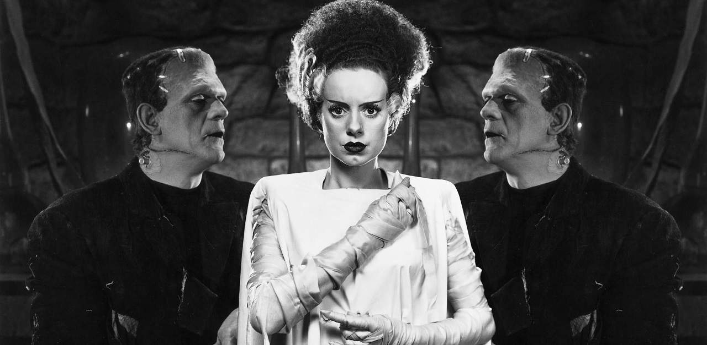

Last week, a friend of mine invited me to zoom in to her gender theory seminar to talk about my participation in Laboria Cuboniks, the
collective that, five or so years ago, wrote the 
[Xenofeminist Manifesto](https://laboriacuboniks.net).

This is a sometimes slightly awkward thing for me to do, for reasons I'll unpack
in a moment, but lately I've been finding myself missing the experience of the
seminar room (or even its long-distance approximation) badly enough that I
happily agreed.

The result was a lot of fun for me at the time, but I found myself a bit
unsatisfied with how I expressed myself, after the fact. My contribution to the
seminar was improvised, jumbled, and messy. This is, to be fair, how things
usually go when I teach, but they're vices that are usually kept in check by
reading the room. This is harder to do without a room.

But I think my engagement also suffered from my confused distance to the text
itself. I don't think I was particularly clear in distinguishing those moments
in which I was unpacking the text, and those in which I was taking it as a
springboard for improvisation.

# On the Authorship of Laboria Cuboniks

But this takes me to an observation about the text itself: There's a certain
sense in which an author's intentions can be seen as giving a text a certain
kind of interiority. Everyone knows that this is a complicated matter at the
best of times, but it's still pretty reasonable, in conversation with an author,
to point to a passage and ask "what did you mean by that?"

There are a few different ways an author can respond to this question. They
might try appealing to memory, and take themselves back to the scene of the
text's creation, and report on what their remembered self was thinking. This is
a sketchy way to go about things -- memory's unreliable at the best of times,
and as the composition of a text recedes into the past, it will only get more
so. But it's doable. The author might remember drafts, notes, editorial
decisions, and scraps from the cutting room floor -- these will help. 
They might recall certain contextual factors that, it turned out, were 
necessary in order to make their intended meaning clear. 

And I think what happens, here, is not just recollection but a kind of alternate
composition: Reproduce the state of mind you were in when you wrote this, and
tell me what you could have written instead, if you'd had let yourself be a bit
more expansive, if you'd had let yourself be informed by thoughts that hadn't or
couldn't have occurred to you at the time. Or perhaps: tell me what you *would*
mean by that passage, if you wrote it here and now. Or tell me what you still
mean. The unity of the author's person acts ties the exposition back to the
original text, joining them into a more or less coherent corpus. Any
contradictions that arise in the process are contradictions that truly *ought*
to be addressed, in the spirit of intellectual responsibility. I suppose that
this is, at some level of abstraction, *part* of what it means to speak as
someone in particular.

There are aspects of the XFM's composition that make this kind of exposition
easier than it might be for an author operating solo. The author of *that* 
text was Laboria Cuboniks, and Laboria's thoughts, insofar as they belonged
to that unity, were *themselves* articulated and recorded in notes, drafts,
emails, and mostly text-based chat transcripts. Quite a bit's been lost to
bit-rot, but the fact that these conversations were at least expressed in
publicly legible form (even if they took place in private, between six friends)
gives a certain durability to their memory. It's probably easier to remember
conversations I've had than the unspoken thoughts that laid behind them. 

But the other side of recollection -- putting myself in the composition's
headspace and seeing what else could have come from it -- is a bit less
accessible to me, at least when I'm speaking about it alone. I'm not Laboria.
None of us are. What I say, now, from that remembered or imagined position
doesn't come from Laboria's mouth. Is it constrained, at least, to be consistent
with what Laboria said? That's not entirely clear.

When we, Laboria, wrote that text, I had hoped to let it remain indefinitely
under the mask of pseudonymity. Laboria was the person charged with authoring
the text, and none of us were Laboria. For reasons that are contingent, poorly
remembered, and still a little unclear, the mask  [(Archived)](https://web.archive.org/web/20220106/https://github.com/oblivia-simplex/genpong)slipped, and we found ourselves
in the role of being authors of a text we'd certainly written, but which we
would have been happy to alienate to another (to Laboria, our little leviathan).
It's a weird mantle to wear.

An early, lightly held goal for the character of Laboria Cuboniks, too, was
for it to be a mask that, in principle, anyone could take up, to speak
from *it* rather than their own particularity. A bit of a gamble, I guess,
and it could've been a shitshow, but it's a little disappointing that this
never quite happened. Maybe we retreated from this idea a little ourselves.
Maybe, despite ourselves, we came to be a little too jealous of our creation,
and failed to clearly advertise that the key was under the mat.

So, you can see how this might make it difficult to distinguish between
what should count as an exposition of the text, and what should count
as an improvisation departing from it. It's a difficulty that I should have,
myself, made clearer, and whi [(Archived)](https://web.archive.org/web/20220106/https://evolution.berkeley.edu/evolibrary/article/evo_24)ch I might have, if I'd given it more thought
beforehand.

We knew that we were writing a pretty gnomic text. Whenever we had to choose
between lucidity and "maximum slogan density", we opted for the latter. And we
had fun with it. There's a very real sense in which the text is *nothing* but a
string of spurs and cues. That was, in a way, the whole idea. We wanted to
write something that provoked more than it contained. That's at least part of
what we meant by "manifesto".

I remember one of the first conversations we had about the project, back in
Berlin, in the summer of 2014. The six of us had met at this summer school that
Pete Wolfendale had put together, under the slogan "Emancipation as Navigation".
As we got to talking, at some point, there was this flash of recognition,
and a sense of shared ambition and purpose. Before the end of the week,
we'd hit on the idea of writing something -- maybe a manifesto -- together.

But we were still a bit wary about starting a new "ism". We'd all seen the 
semantic disaster that had become of "Accelerationism", which some friends (some
of whom were present at that event) had tried to put to use a few years earlier.
None of us relished the idea of fighting for a descriptor, newly coined or not. 
We wanted to write and see what gelled, without stamping a seal on ourselves in
advance. But we liked the idea of creating something that could be taken up
collectively, something we didn't control. The idea of creating a shared
pseudonym *instead* of naming a new movement seemed like an interesting way of
doi [(Archived)](https://web.archive.org/web/20220106/https://www.mcgilldaily.com/2014/11/everything-problematic/)ng just this. We wanted to experiment with the kind of multiplicity-in-unity
that can be found in a proper name but not in a descriptor. 

And yet, at some point, as a sort of compromise that I don't quite remember
the reasons for, we ismed up, regardless. I still don't know how I feel about
that. It's certainly not a bad thing to try to concisely state your intentions,
and it certainly gave the text (and the project it aimed to spearhead) a
reproductive advantage that lacking a one-word descriptor might have cost it.
But so it goes.

# An Incomplete Balance Sheet

Let me first be clear that I'm writing as Lucca, here, and not as Laboria.
I want to try to sort out the elements I still carry with me from that
text from the elements I've largely left behind. 

## Alienation

A maze of twisty little meanings, each unlike the other, and a perpetual source
of frustration. Sometimes a little embarrassing. Why are you all asking us about
alienation? I could ask. But, no, we went and put it in smack at the end of our
title: "Xenofeminism: A Politics for Alienation". Did any of us behind the mask
have a particularly clear and univocal idea of what we meant by "alienation", or
were each of us assuming the understanding of another? I'm sure we must have had
some lengthy conversations about this. 

I believe that the *dominant* meaning of the term was something like
"deracination" or rootlessness -- and phrases like "a critique of the politics
of immediacy" were on our lips -- something that may have been both a caricature
and generalization of the already loose-fitting clown suit of "folk politics"
that Nick Srnicek and Alex Williams had attacked in their own manifesto. "Left
Accelerationism" was a scene in which we had at least a few feet, at the time of
writing. I was on the periphery of it, myself, connected to it mostly by my
friendships with Pete Wolfendale, Reza Negarestani, and Mark Fisher. Helen and
Nick were already close at the time (they're married now). We considered
ourselves sufficiently distant from L/Acc to avoid aff [(Archived)](https://web.archive.org/web/20220106/http://www.bbc.co.uk/guides/zxsfyrd)iliating ourselves with it
by name, and early on decided *against* calling our project "accelerofeminism"
-- but the fact that that was a decision to be made tells you *something*.

The term "alienation", though, is needlessly confusing, especially in the
context of a leftist manifesto. Maybe there was something a little beligerent in
using the term, regardless. Maybe we were even tempted by its contrarian sheen.
This isn't a very flattering portrayal of our motives, and I hope I'm being
excessively cynical here, and that we didn't *intentionally* bait our hooks with
confusion. But I do find myself on my back foot every time I'm asked to explain
this term and the role that it plays in the manifesto -- which is at least a
little embarrassing, what with it being, like I said, in the title of the text.

## Nature

I largely stand by everything we said about our joint commitments to 
normative anti-naturalism and ontological naturalism. Efforts to claim 
moral mandates from "Nature" are generally spurious. The cosmos is not
only utterly indifferent to our ethical plights, but categorically unfit to
legislate over them. And yet ethical reasoning doesn't *require* anything to
exist "outside" of nature, where nature is understood as the "arena of the
sciences" -- as that which can, in principle, be rationally known and
experimented upon. More or less, anyway. I admit that this way of defining
"nature" is a bit unsatisfying and polemical. 

There are certainly some complicated corner cases and ambiguities, when it comes
to articulating the domains of practical and theoretical reason, but I think we
left room for those in the text 
([see 0x12](https://laboriacuboniks.net/#adjust/2)) 
-- in a cryptic way, for sure, but
one that I'm still pretty happy with. (I will say that the question of truth
presents a particularly interesting complication to this picture: if "P is true"
follows from any fact P, and truths present us with cognitive obligations --
they, in some sense, demand to be acknowledge *as* true -- then we have at least
one way in which the descriptive crosses into the normative, something I hope
to return to in a later post.) But where does the urgency, the political
centrality of the question of "normative naturalism" come from?

I think it would be a mistake to take those who appeal to "Nature" to justify
their cruelty at their word. I think that if you take that particular crutch
away from them they'll quickly find another. If they can't whip you with a
willow switch, they'll whip you with a belt. We were perhaps a little naive, or,
as one friend puts it, "idealistic", in framing our disputes in this way.

The historical reasons for the centrality of the question of "Nature" in the
text seem to me to have been largely contingent. We were all deeply impressed
with Shulamith Firestone's *Dialectic of Sex* at the time, which freely and
boldly raises the call for a "complete domination of nature" in the fight
against patriarchy. And some of us were deeply entrenched in arguments against
Nick Land, and his [GNON](http://www.xenosystems.net/the-cult-of-gnon/)-adoring
epigones. And for my part, I had come to see Mary Daly's *Gyn-Ecology* as the
urtext of the dominant anti-trans tendencies in eco- and radical feminism. But a
different set of cross-cuts through the present could probably have found a host
of different idols to smash, with equally inconsequential effects, all equally
failing to get to the root of the problem in practice.

## The Cyber-Kitsch Aesthetic

No regrets, here. It was a lot of fun at the time. We knew we were going over
the top, and we enjoyed the ride. We enjoyed channeling the energy and optimism
of mid-90s cyberfeminism and hacker culture. We wanted that 
[VNS Matrix](https://vnsmatrix.net/) vibe. 
We embraced all that camp and the cringe in a way that felt fearless, powerful,
and reckless. It was a loud signal of our indifference to academic
respectability and coolness. It was a garish, neon swagger. I still respect it.
Not really my aesthetic cup of tea, these days, but I respect it.

## Universality

I think we were all a little dissatisfied at the way in which the reflections 
on the universal in the XFM remained a sort of promissory note -- which we'd
undersigned, depending on which of us you ask, with extremely vague gestures
to Badiou's notion of the "generic", or Zalamea's of the "synthetic". I'm not
convinced we managed to add anything new to the pot. 

My own contributions leaned on Badiou's. At core, I think, it was meant as a
principle of egalitarianism and political non-exclusion. We wanted to set our
sights on a truly universal emancipatory project, whose universality would
consist in the ways that it (somehow) cuts across all of the existing
divisions of the world. 

It could be said that this is vague to the point of near vacuity, and that
whatever precise content there is here could already be found in Badiou's
writings, which honestly aren't without their own troubles when it comes
to finding concrete examples and prescriptions. That wouldn't be wrong.
Our reach exceeded our grasp, here.

## Transsexuality

The XFM has been criticised for falling into the same trap into which so much of
academic "trans theory" as fallen: the concrete historical reality of
transsexuality is admitted only insofar as it decorates the coat of arms on some
existing metaphysical banner. 

I think this is a very real danger, and if I did this, I wouldn't have been the
first to seek theoretical respectability by sublimating away the concrete
conditions of our lives. I do think that there's still some truth in what
Laboria said on this point, though -- that something of "world historical
significance", as a friend of mine likes to say, has been happening to the
prevailing understanding of sexual difference ever since we came about. And
there's a kind of dignity in this that I think is worth calling attention to,
because what is at stake there is, ultimately, freedom. And I do think that
there is some degree of bad faith at work when we lean towards narratives that
obscure the elements of choice and chance in our relation to gender. 
[Paragraph 0x0B](https://laboriacuboniks.net/#trap/3) is the one I have 
in mind, here.

I suppose it's the dismissal of "the disciplinary grid of gender" that drew
criticism, here -- the same that I've seen directed at, say, 
Sandy Stone's ["The Empire Strikes Back: A Post-Transsexual Manifesto"](https://uberty.org/wp-content/uploads/2015/06/trans-manifesto.pdf):
It may seem as if, just as we have managed to carve out more or less livable
lives for ourselves, we're being told that if we truly want to lay any claim to
dignity, we need to radicalize those gestures beyond the point of comfort -- a
demand that doesn't appear to be made of the cis. We (and, it seems, we alone),
are expected to become "monsters", to become emblems of liminality, so that we
may dramatize transcendence and expand the horizon of the possible for those
with no skin in the game.

This is neither what I intended, nor how I originally read Stone, but I can't
say it's an unfair attack. A bad philosophical habit? According respect to the
real only insofar as it approximates some ideal, at its limit? There's a danger
in making a burnt offering of the concrete (or even oneself) with such gestures.

## Virtue and Corruption

"We want neither virtue nor terror," we wrote, in an anachronistic swipe at
Robespierre (we really chose some bizarre coordinates, at times), "we want
superior forms of corruption". But what did we (or Laboria?) mean by "superior
forms of corruption"? I know what this passage came to mean for me, as the ideas
around it became clearer: it ultimately led to a preoccupation with, precisely,
virtue -- in the classical, ethical sense: the cultivation of character, of
those habits conducive to εὐδαιμονία. 

The idea, articulated much more clearly, I think, in an 
[improvised talk](/posts/LC_in_Bratislava.md#corruption)
I gave in Bratislava, a few years ago, as part of an event devoted to "The
Question of Will", along with four other members of LC. The couching of all of
this in some ruminations concerning memetics is secondary, and maybe I'll get to
that element later. The main idea, here, is that if we ask ourselves "why do we
behave as we do?", I think we find that only a minority of our actions are
truly deliberate *acts*, backed by truly thoughtful choices. The ratio might
vary, but I think that in most cases we are buffetted through life by a host of
subtle incentives and inclinations, and that it's this sea of trivialities that
sets the terms for those relatively rare forks in the path where we find
ourselves genuinely forced to choose.

The topic of virtue, or character, arises when we take this sea of trivialities
-- of habits, of unconscious desires and drives, of subtle incentives -- as
being itself the material of ethics. It's a matter of recognizing those forces
that "corrupt" our judgement and capacity for judgement (in the sense in which
we often say that "money corrupts", for example), forces that form and deform
our selfhood, and going to work on them, as a way of achieving a kind of
*mediated* self-mastery. We might never be fully transparent to ourselves, but
there are many ways of approaching ourselves from the outside -- in all our
opacity -- and shaping the elements that shape us.

The XFM looks, briefly, at the collective dimension of the problem of
cultivating virtue, and asks us to consider not just the *content* of
our politics when we weigh them in the balance, but their pragmatic effects
as well -- not just what they explicitly ask of a subject, but the kinds of
subjectivity that they work to shape, in practice. What habits must these
discourses (or "memeplexes") instill in us in order perpetuate themselves? What
kind of moral agents and patients do they make us? That sort of thing.

It's a pretty loose gesture, like everything in the XFM. More a prompt than
a position. But I do still think it's worth meditating on. And if my current
research has been taking me a little further into, say, Hellenistic ethical
teachings and psychotherapeutic theory, this is one of the reasons why.

# In conclusion

I might as well wrap it up, here. No need to try to be exhaustive. I'm sure
I'll find myself drifting back over this territory again, sometime, in the
future. Better to just let this stand as it is, I think -- a few notes,
all pretty provisional, looking to loosen a few knots here and there.

