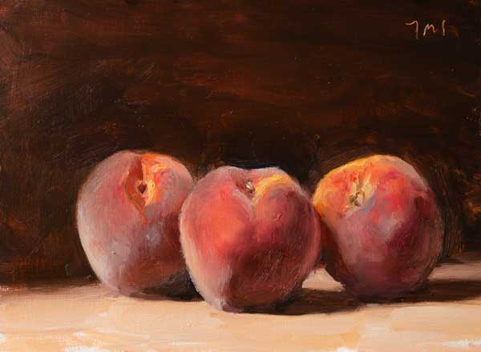

**As Ashley massaged** the loose skin free from the flesh of a boiled peach, the last one of one of the day's last batches, each batch a batch of a dozen, at least, and braced the knife's blunt edge against his blistered thumb, numbed from being plunged <!-- or: "from plunging"? --> into a bowl of molten ice to fish one peach out after another, his thoughts would pool in the familiar hollow the familiar work hollowed out. They concerned his wife.

When the blade bit the pit he tilted the knife til the incision connected full circle. He thought about Sheila. With a little twist he split open the peach and he couldn't really be near her these days. He scooped up the slippery halves of it, at a loss to say what remained to be tried, though all of it still felt so strange to him, and the peach slices lept like a pair koi right into the jar. His thoughts primarily revolved around the fire, around his wife and the fire, even if they were now and then eclipsed by thoughts of the nurse, Javier. He gathered the pits in an ice-cream bucket. <!-- that the sun had bleached a dull green. -->

 

<!-- Image credit: Daily paintings  Three peaches  Postcard from Provence at <https://shiftinglight.com/2019/06/three_peaches_190611.html> -->

His flipflops made a puckering sound as he stirred the syrup and lowered the flame and set the honeycomb of mason jars tinkling. The pine walls, beaded with varnish, gave the kitchen a warm and amber cast and the smell of peaches had been luring wasps. On three occasions, now, he'd had to dump an entire jar into a colander in the sink, turn on the tap, and press his unblistered thumb to the mouth of the spout to pressurize the stream and force their twitching, brittle body through the slits. Every time it made him shudder. He'd pause to catch his nerves and look out over the orchard from the window above the sink. It was an overcast afternoon, with an even gray light that left everything gray. A glider turned in broad and patient arcs, so close to the clouds in colour that only movement gave it away. Up close something twitched at the edge of the screen. Brassy legs and antennae and a glistening and a wispy ovipositor. There was something urgently intimate in how it uncoiled and coiled that thing. "*Stumpfucker!*" he heard himself sputter and scrambled about for a weapon. He grabbed a bottle of Joy and bludgeoned it with the butt of it before it could crawl through the hole in the screen. Ropes of dish soap shot towards him. He smashed it again and again and when he had separated the thing from its abdomen and it still wouldn't stop twitching he dropped the bottle and with his face winched into a fleshy knot he yanked the tin can out from under the sash and the window slammed shut so hard and so fast for a second he thought it would crack.

The peaches in the sink were covered in soap. Pieces of his late father-in-law's beach glass collection were scattered about the sink. A few were on the floor. He crouched down to gather them up and heard a low voice behind him.

"Ash?" 

He unclenched the fist of his face and looked up. Javier was standing behind him, in his indoor sneakers and egg-white scrubs. 

"Ash, are you hurt?"

"No, no, sorry, no, it was just a stu -- just a wasp. It was just a really big wasp. In the, uh, fuck --" He felt his face getting hotter.

"Ash, you're swelling up. Are you allergic?"

"No. Sorry," he said. "No, sorry, I'm not. It's... I'm... it's fine, I'm okay."

"Here," he said, unzipping a burgandy fanny pack and rooting around inside it, "let's put some calamine lotion on it."

"No, sorry, I'm, I'm okay, I didn't get stung. I'm okay. I got it."

At this Javier appeared to relax, and his broad smile returned. He snapped his fingers into a gun and winked. "I'd hate to see the other guy," he said.

"Oh, huh, yeah, haha, yeah, yeah, haha, yeah, oh yeah," said Ashley, "haha, yeah, he, uh, I mean she, uh, yeah, he won't be bothering *us* anymore! Haha!" said Ashley. He crouched back down to pick up the beach glass. "So how's she doing?" he asked, without looking up. "Sheila, I mean."

"Oh, she's doing very well," Javier said, a bit dreamily. "She's a very intelligent woman, you know, very wise." Javier chuckled, "clearly, of course, you know this."

"The, uh..." Ashley trailed off.

"No, of course, " he said, "the fire, yes, of course, she's still on fire," which Ashley did not find surprising, of course, but these queries had become routine. Javier closed his eyes and inhaled. "Mmm... it smells absolutely divine in here," he said, as Ashley rinsed off the beach glass and put it back on the sill. "We can't wait to taste this year's peaches, Ash. This means so much to Sheila, you know." Javier turned to exit, paused, and raised and lowed his foot. He fished a wet-nap from the fannypack, wiped off the soles of his sneakers, and returned to the master bedroom.

It was three years, now, since the fire began, which was, in itself, unusual. Of course even one year would have been strange. To spend even a day engulfed in flames is unusual. And unharmed, all the moreso. Whether restricting oneself to a diet of peaches, and nothing other than peaches, was normal under these circumstances was something he had no way of knowing. He asked his cousin (the nutritionist) about it, once, but she told him, "I don't know what to tell you. It isn't something I've seen before, if I'm going to be honest about it." "In your practice, you mean?" he asked, deferentially. "No, I mean, not at all, no," said his cousin. Yahoo wasn't any help either. It was unclear what to expect with these things. The strange thing, it was widely agreed, was that the fire didn't burn her -- didn't cause any tissue damage, at least, according to Javier. Nor did it spread to anything she touched. When she caught it, initially, and for quite some time, they were careful not to burn down the house. She lived in the tub for an entire week. Ashley brought her meals but she'd leave them untouched. Finally they hit on the peaches. The bathwater, disappointingly, had no effect on the flames, besides making them noisily sputter. In time this became so annoying to Sheila that she drained the tub and just sat there, on the enamel. When she noticed, by accident, that the curtain didn't burn, they gingerly began to experiment. The fire, it seemed, clung to Sheila. Or maybe only to flesh. The possibility of it spreading to another human body was simply too dangerous to test.

The difficult thing was his asthma.

The fire never produced any smoke, or anything that looked like smoke. But something was up with the air. He started to develop an allergy, hayfever, he assumed, at first, but it persisted well into winter and on a late afternoon in February he started to notice the threads. They hung in the air all around her and had a way of sliding slowly about that distinguished them somehow from dust motes. "They had a purposeful way of moving," is how he might have described them if he were still at home in language. 

Unlike the fire, whose existence and gravity were uncontroversial, these ephemeral glassy filaments bothered him alone. Not only were they hard to see, and under most angles of light imperceptible, but his symptoms seemed idiopathic. Every doctor he spoke to was skeptical that there was anything unusual in the air at all, and he suspected the friends who had nodded and said, "yes, yes I see what you mean," had just been trying to humour him. Neither loratadine nor cetirizine hydrochloride provided any relief at all. Fexofenadine made the symptoms worse and diphenhydramine made him drowsy. An exposure of just a few seconds would have him coughing the rest of the night. When he spotted the tiny red specks on his sleeve after a night of tossing and turning and coughing in fits, on the hide-a-bed in the living-room, he decided the matter was serious and sought to hire a nurse.

They both got along well with Javier, who was always conscientious and courteous. He brought gifts for the couple on every solemnity in the Catholic liturgical calendar, including many of which Ashley was ignorant. On the Assumption of Mary, for instance, he gave Ashley a bottle of *Lepanto* brandy, and Sheila modest pearl earrings. On All Saints' Day, he gave Ashley *Resolí* and Sheila a tasteful pearl brooch. On the Solemnity of Our Lord Jesus Christ, King of the Universe, Ashley received a green liqueur in an undulating bottle labelled, *Hierbas de Malloreca*, and Sheila got a pearl necklace. And so it went, consistently and unceremoniously. Ashley tried to demure, at first, on the occasion of the first Assumption, and called Javier into the sun porch while *Rigoletto* played loud on the radio. He mumbled something about how Sheila, these days, had no use for jewelry, and how the fire would probably damage it (it wouldn't, he knew; the fire clung to her jealously and had never scorched a thing she wore), and that they couldn't, in any case, accept these gifts, it's enough that they pay him so little, but Javier only shrugged and smiled and said it was no trouble at all. The jewelry, he said, was a hobby of his, and the pearls had come to him cheaply. The liquor was something he inherited, and he never drank a sip, himself.

Once the last of the batch of peaches was sliced up and jarred, Ashley washed his hands. He dried them off on his khaki pants and slipped on a pair of oven mitts. He carefully lifted the pot of syrup from the stove and poured it into a watering can, from which he poured the syrup into each jar, leaving a half-inch of headspace. Here and there a slice of star anise would slowly bob to the surface. After shooing the remaining wasps away, he placed the lids on the jars and screwed on the rings. The big canning pot took ten at a time and he wrapped each in a thin cotton rag, torn from a worn-out bedsheet, so as to keep them from cracking when the water boiled and jostled them against one another.

He fished a Red Bird match from a flowerpot on the fridge, struck it against the side, and lit the stove's larger front burner. The ignition switch had been broken for years, despite his frequent vows to fix it. There was a time, in the first six months of the fire, when he'd blame the stove for what happened, or at least make an effort to do so, as a means of blaming himself. He'd occasionally find himself saying things like, "I should never have let you use that stove, not in your condition," but his voice would lilt at "*condition?*" as if the apology were some sort of plea. It was not for lack of feeling that the words lacked all conviction, being less an empty vessel than a sieve. What *condition*, after all, could he have possibly meant? What dull-witted meaning would crawl from the woods and get caught in that apologetic net? If his intention was to draw out an avowal of guilt, or of the Hand of God at work in this world, he wriggled on that hook alone. What bothered him most, as he heard himself speak, was the peculiar tone of his voice, which he judged irredeemably mewling. He tried to correct it. He tried to speak with his chest, like an actor. This, the critic he once was would've written, had him "delivering the his lines histrionically," or in a crueller temper, "hamfistedly, failing to stoke the slightest conviction and leaving the audience cold."

His theatre critic days were behind him. This was due to the withering of the fourth estate, in fact, only in part. His facility with language had left him. The diaries he still kept and scribbled in daily he could no longer bear to read. His worries clattered out of him in clunky blocks of cliché. Coarse cries of pain collaged from commercials. He was no longer at home with words.

<!-- fix this first sentence -->
There was a pulse of flickering light in the hall and a brief unmuffling of bright conversation that swiftly gave way to goodbyes. Ashley turned from the stove to see Javier return. 

"You know, Ash," he said, while the canning pot boiled and the mason jars clattered, "she cares for you a great deal. She has such appreciation for you. Do you know that?" Ashley bobbled his head and smiled at the warmth in Javier's voice. Javier removed his tennis shoes, placed them neatly next to the door, and pulled on his rubber boots. He hoisted a heavy green raincoat from a peg beside the door, and gripping the cuffs of his sleeves so they wouldn't ride up, slowly pulled it on, without taking his eyes off Ashley. "I do hope you know that." He turned towards the door.

Fiddling with a peach stone he'd just finished scrubbing, Ashley fumbled for words. "Oh, Javier, the, uh... they're ready for you," he said, in a voice that felt flustered and stilted. "The peach stones, I mean," he said, nodding at the bucket on the edge of the table. Its Neopolitan label had been bleached by the sun, merging the strawberry with the vanilla and leaving the chocolate a dull shade of green. 

"Ah, I almost forgot!" Javier said and started to pull off his boots.

"It's fine," Ashley said, "I have to mop anyway." 

Javier shrugged, checked the seal on the bucket, and then pressed it tight til it clicked on one side. He shook it gently and said, "thank you, Ash!"

"I've... I've been... sorry, I've been meaning to ask," said Ashley, "what do you, uh... I mean, do you garden?"

"Truly, Ash, thank you!" Javier gripped the bucket with a single hand as if it were a cup of coffee. "I do appreciate this." 

Something outside the window caught Ashley's eye and he turned to see what it was. 

"And no, I don't garden," Javier said. "But -- truly, Ash -- thank you." He lifted his backpack from the peg where his raincoat had been hanging and heaved it over his shoulder. He swung it back around and unfastened the flap. "Ash, I almost forgot," he said, "I have something for you." He stood a bottle of *Gusano Rojo* in the clear patch of space on the table.

"Thank you, you didn't have... no, I mean, thank you," said Ashley. Javier smiled broadly and left.

Behind the muted clatter of jars it was quiet. <!-- here's where the idea of pearls in the peach pits has to be telegraphed --> Ashley cleared out the sink and ran the tap, and waited for the water to get warm, restlessly scanning the sky as he waited. It was a while before he could see it, in the late afternoon, with its colour being already so close to the clouds'. But he saw it, tracing another generous arc over Sheila's father's orchard. It vanished, for a time, behind the house, and circled the orchard again. Ashley was still holding the pit he was holding when Javier had entered the kitchen, and that he was holding when Javier left. He unclenched his hand and caressed it, moving the blistered pad blistered thumb in tiny, circular motions. He considered pouring a shot of mezcal. He wondered what gift Sheila'd been given, and how the colour of the flames would change just slightly in a blue areola around the pearls, as if their weight had somehow bruised them. This delicacy left him shaken. He leaned against the kitchen sink and felt a line of soapy water press underneath his navel. 

He tugged on the knob of a drawer, jiggling it a bit it to jostle loose the ladle that was jamming it shut. He rummaged about till he found it: an oyster knife with a two-inch blade and a green, textured handle that made it easy to grip. He looked away from the chintinous mess in the screen and focussed his eyes on the pit. He cupped it in his hand and squinted. He set it back on the counter. The threads of pulp that clung to it moved like the air above a barbeque, or like algae underwater. Of course. He fished his reading glasses from the wicker basket, beside the pot on the fridge. He wiped them off on his shirt before putting them on. He cupped the pit in his clammy hand and gripped it. He held it steady with his thumb and squinted. He trained his eyes on the seam. Yes, yes of course. Of course. Where else? Of course! He pressed the tip of the knife into the crease and cautiously -- cautiously -- twisted. The knife skidded loose. His pulse pounded at the base of his ear. His clothing felt twisted and knotted. The running hot water was fogging his glasses. He wiped them clean and inspected his hand for cuts. He found none. He drew a breath and clenched the peach pit back in position. He pressed the knife again to the seam. A little bit firmer this time. He waited to feel it find purchase. A sharp hiss of brine. An opalescent droplet beaded on the seam. He wedged the blade deeper and twisted. 

<!--
The pit popped open and the pearl shot out. It clattered against the walls of the sink and circled the drain like a pill. 
-->