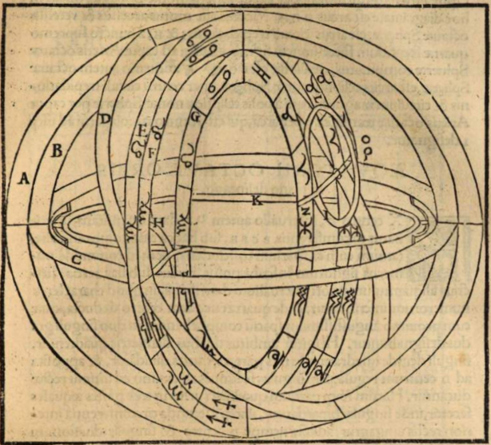

## Preface

Over the pandemic, [Emily McMehen](https://www.emilymcmehen.com/) and I have been prompting one another to write by choosing a handful of more or less random, more or less arbitrary constraints, obstacles, or elements -- most often by grabbing a book off the shelf and flipping to a word with our eyes closed, or by pulling a card from a tarot deck, or something along those lines. We’ll then give one another a few hours to sit and write something that obliquely incorporates the elements picked. Usually something in the neighbourhood of 500-1000 words. Sometimes these go on to be worked into fully ripe stories, sometimes they sit in the scrap heap awaiting future use.

As a little experiment, I think I’ll try “showing my work,” here, at the risk of depriving the text of a chance to stand on its own. But I’ll do so at the end of the story (or fragment?) so as to at least get out of its way.

## One Lip to Earth and One Lip to Heaven

To a smaller than average man -- stretched out in the crease of her tongue with his heel hooked lazily over his ankle, leaning back, palms flat, idly massaging the shag of papillae with his fingers running between them -- to him, the view would be beautiful. The rusty bluffs of teeth above -- he couldn’t see the lower row, on account of the bulk of the tongue -- would have parted directly before him. And being the only soul sitting right there, it’d feel -- he’d know it isn’t so, but it would *feel* -- like they’d parted just for him, so that he could see what he would see: one lip eclipsing the earth below, the other wrapped around heaven in its trembling emerald firmanent. The vapours would sting his eyes and so he’d blink them hard and fast. They’d water a bit, which would help. Light would play on the cosmic glass and warp as the universe tilted. He’d have to shift his weight back to his palms, and clench fistfuls of taste buds to keep from slipping. But not because he’s afraid of dying. He would be afraid, of course, like anyone would be, but he’d know where he is and why. He’d know what’s going to happen. He’d’ve found his steel. He’d breathe in through his nose, and out through his mouth and he might be getting a little lightheaded but his sinuses would be clear. He’d think of the day his son had brought him to a Turkish bath in the city, and the bowl of eucalyptus oil that wobbled the light on the tiles. His thoughts would clear. He’d breathe in through his nose and out through his mouth. It wouldn’t be that he wasn’t afraid. He’d just want to meet it calm and alert, and not scurry away from the beauty of the thing like he had somewhere better to be. As the slope of heaven grew steeper he would brace himself, pause, let his muscles go slack, and allow his body to yield. Without closing his eyes or clouding his view he’d imagine his skin sloughing away and the cage of his chest hatching open. When the golden river poured in at last he’d surrender without hesitation.

But there was less than a sip in there left.

He’d barely’ve gotten wet.

Shalim lobbed the Great White empty onto the heap of coats in the corner and stood. This proved overambitious. She sat back down on the air mattress that had deflated overnight and put her head between her knees. Her bowels squealed and squirmed at the pressure. She sprawled savasana and counted her breaths. She got back to her feet, moving slowly with a hand on the wall. She squinted. The sun was at its winter peak and cut through the glass at eye level. She stumbled across the living room to the clothes heaped in the corner. Patches of carpet were wet. A CD case crunched underfoot. She patted down the faux fur coat on top till she found a pair of sunglasses, Mike’s. They gave him a feminine, buglike look. She put them on. They helped. <!-- boil behind her ear pressed by arms of sunglasses --> The green glass bottle with the shark on the label had rolled to the side of the pile. Her throat was parched and her tongue felt thick so she took it and made her way to the kitchen.

The dishes were piled high in the sink, with an unfinished bowl of cereal wedged right underneath the spout. She loosened a plate from beneath the bowl with the bottle tucked under her arm. Ceramic ground on ceramic. A white-winged moth on its back in the milk flailed its miniscule legs.

## Obstacles

### The Word ‘Jerusalem’

A plausible etymology of the city’s name, as [Wikipedia has it](https://en.wikipedia.org/wiki/Jerusalem#Etymology), traces it back to the phrase,

> “*foundation* (Semitic *yry’* ‘to found, to lay a cornerstone’) *of the god Shalem*”; the god Shalem was thus the original tutelary deity of the Bronze Age city.
>
> Shalim or Shalem was the name of the god of dusk in the Canaanite religion, whose name is based on the same root Š-L-M from which the Hebrew word for “peace” is derived (Shalom in Hebrew, cognate with Arabic Salam). The name thus offered itself to etymologizations such as “The City of Peace”, “Abode of Peace”, “Dwelling of Peace” (“founded in safety”), or “Vision of Peace” in some Christian authors.

Digging a little deeper, what caught my attention was the collective description of the siblings Shalim, the god of dusk, and Shahar, the god of dawn, as “the voracious gods of day”, in Ugaritic texts. Dennis Pardee presents [an anotated translation](https://new2torah.com/PDF/Dawn%20and%20Dusk%20-%20The%20Birth%20of%20the%20Gracious%20and%20Beautiful%20Gods.pdf) of one of these texts in [The Context of Scripture: Canonical Compositions from the Biblical World](https://www.amazon.com/Context-Scripture-Canonical-Compositions-Biblical/dp/9004106189):

It was this verse that caught me:

> **One lip to the earth,  
> the other lip to the heavens,  
> Into their mouths enter  
> the birds of the heavens  
> and the fish in the sea.**

Here’s an ivory panel showing what appears to be the goddess Asherah nursing the voracious twins, Shalim and Shahar.

Image taken from Jacqueline Gachet-Bizollon’s article [“Le panneau de lit en ivoire de la cour III du palais royal d'Ougarit,”](https://sci-hub.ru/10.2307/4199378) in the journal *Syria*, tome 78 (2001), p. 29. 

This gave me a place to start.

### The Word ‘trepidation’

I found this truly beautiful *Webster’s Twentieth Century Dictionary (Unabridged)* a week before Christmas, on the shelves at *Value Village*. There’s something I love about leafing through a vast paper dictionary, with its tiny lithographed diagrams, its onion skin paper, all its happy accidents... So much nicer than digital. It just has a warmer sound.

This dictionary has the following entry for *trepidation*:

> From the Latin, *trepidatio*, a trembling, from *trepidatus*, present participle of *trepidare*, to tremble, from *trepidus*, disturbed, alarmed.
>
> 1. An involuntary trembling; a quaking or quivering, particularly from fear or terror; hence, a state of terror.
> 2. A trembling of the limbs, as in paralytic affections.
> 3. Any vibratory motion.
> 4. In old astronomy, a libration of the eighth sphere, or a motion which the Ptolemaic system ascribes to the firmament, to account for the changes and motion of the axis of the world.

The fourth, above all, caught my attention, and dovetailed nicely with the voracious Shalim.

### The Six of Swords

Here’s Pamela Smith’s illustration from the classic Smith-Waite deck, the version Emily and I used for the cue:

“A strange and powerful image,” [Rachel Pollack writes](https://bookshop.org/p/books/seventy-eight-degrees-of-wisdom-a-tarot-journey-to-self-awareness-a-new-edition-of-the-tarot-classic-rachel-pollack/6897630),

> this card more than any other illustrates how Pamela Smith’s images reach beyond Arthur Waite’s formulas. *The Pictorial Key* says ‘journey by water, route, way, expedient’. But the picture of a ferryboat at twilight, carrying shrouded figures to a wooded isle, suggests a more spiritual journey -- in myth, Charon carrying the dead across the River Styx. A great silence fills this card, like the silence of Salvador Dali’s paintings.
>
> Usually this card does not signify death, though it can indicate mourning; nor does it show transformation, in the sense of Death in the Major Arcana. Rather it depicts a quiet passage through a difficult time. Waite says, ‘The freight is light’; and Eden Gray writes, ‘The swords do not weigh down the boat’. [...] On a simple level it means functioning in some difficult situation without attacking the problems. It can refer to an immediate problem or a situation that has gone on for years. Looking deeper we see the image of a long sorrow -- mourning is an example, but not the only one -- which a person has felt for so long that it no longer gives pain, but has become part of life.

The card brings to mind another image: an insect, on its back, on the surface of the water, with its six legs up in the air -- though this connection only became explicit *after* I’d written the story. A few minutes ago, in fact. While writing I was just keeping the card’s vibe in mind.
