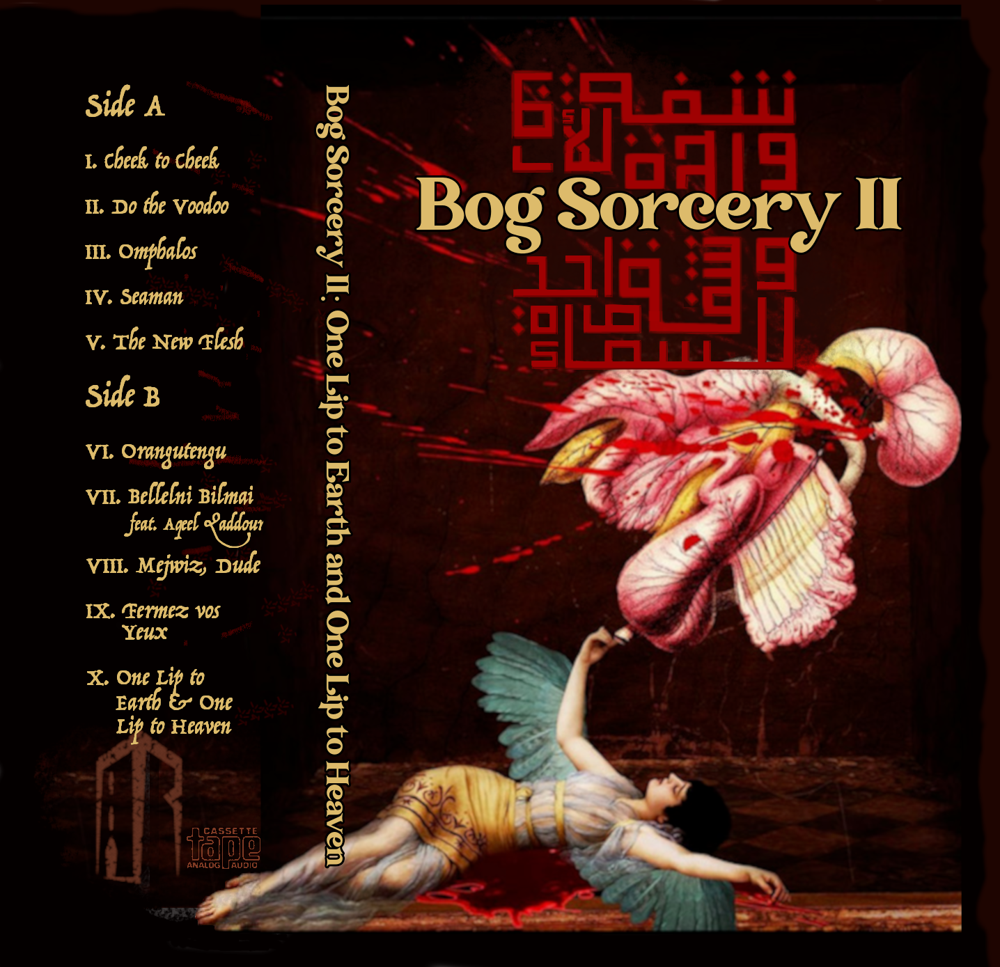
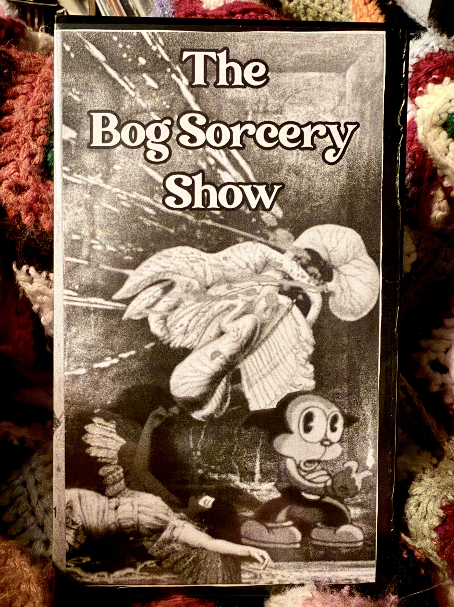
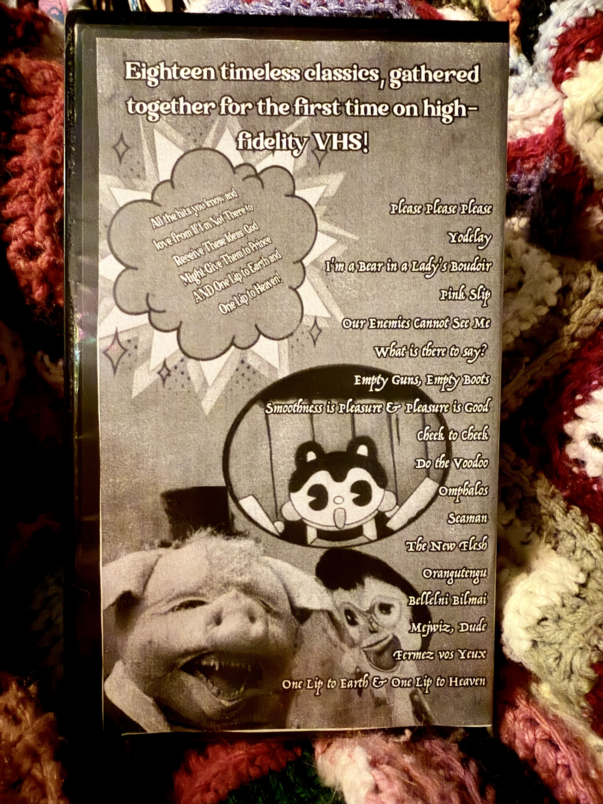

Today's the day, wetland lovers! The independent French record label, Dungeon Radio, is releasing my second solo album, [Bog Sorcery II: One Lip to Earth & One Lip to Heaven](https://dungeonradio.bandcamp.com/album/one-lip-to-earth-and-one-lip-to-heaven) at 9pm CET. Join us for the [video premiere on youtube](https://www.youtube.com/watch?v=vCT73iwGLgs)! 

Credit goes to Maressa Axtmann for the beautiful collage used in the album art, originally designed for the short story I wrote a few years back that planted the seed for this album. You can find it in its totality [here](2023-01-15--one_lip_to_earth_and_one_lip_to_heaven.md).

## Cassettes!

We're doing a limited edition cassette run for this one, so head on over to Dungeon Radio's bandcamp to get one while they last!

## VHS!

And we're doing something special for this one: a VHS double video album, containing all the songs from both Bog Sorcery I *and* Bog Sorcery II. 

If you miss your chance to grab these fine relics from bandcamp, you'll have another chance at merch table at Sappyfest, in Sackville, NB, between July 31st and August 2nd. Why there and then? Because SWAMP MAGIC IS PLAYING SAPPYFEST THIS YEAR, that's why! More about that soon!
