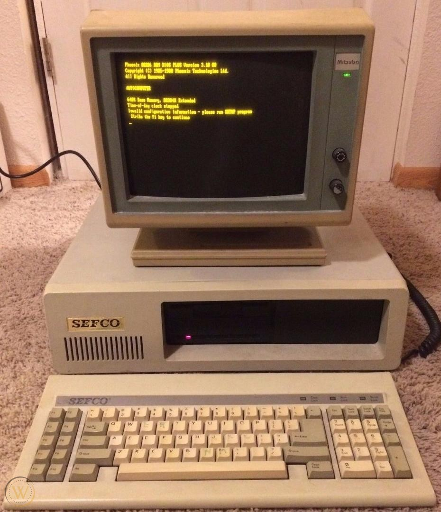
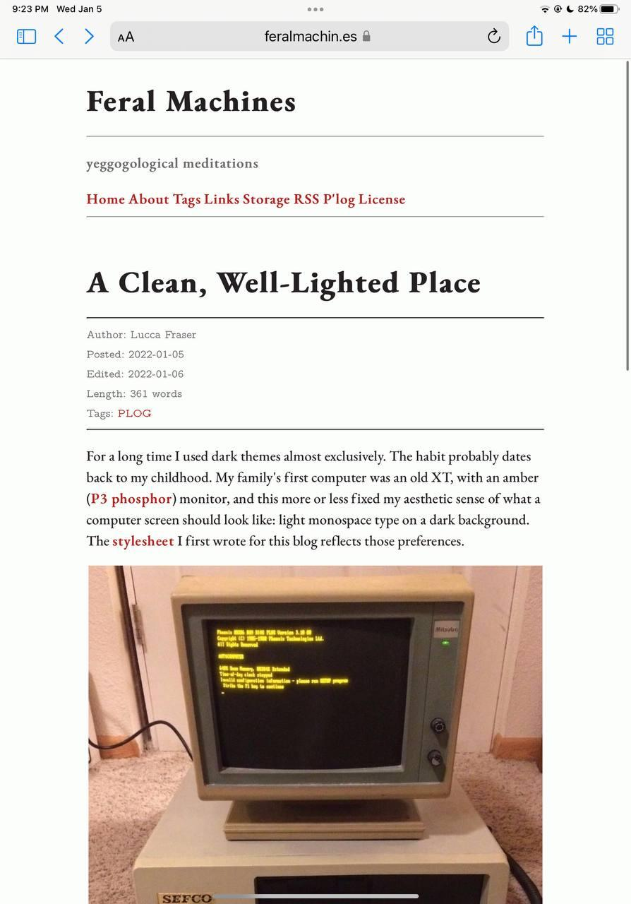

For a long time I used dark themes almost exclusively. The habit probably dates back to my childhood. My family's first computer was an old XT, with an amber ([P3 phosphor](https://en.wikipedia.org/wiki/Phosphor#Standard_phosphor_types)) monitor, and this more or less fixed my aesthetic sense of what a computer screen should look like: light monospace type on a dark background. The [stylesheet](/css/darkmode.css) I first wrote for this blog reflects those preferences.

I still prefer this combination for terminal work and writing code, but (though it took me some time to admit this) I've never quite liked it for reading or writing prose. I really do love a good typeface, and the very best -- I'm thinking of [Bembo](http://www.georgduffner.at/ebgaramond/) or [EB Garamond](http://www.georgduffner.at/ebgaramond/) -- look dreadful when inverted into light-on-dark. Seriffed typefaces in general suffer when displayed in this way, with a few exceptions. I think [Latin Modern Mono](https://www.fontsquirrel.com/fonts/latin-modern-mono) survives just fine (slab seriffed and monospace fonts tend to fare well), and that is indeed the font I chose on for this site's dark theme. (It appears in the monospaced elements of the light theme as well, like the metadata block.) The quality of LCD screens has improved enough over the past several years that reading a well-illuminated screen seems far less painful than it used to be.

Anyway, after a couple hours of tinkering around with the CSS, I set up both [dark](/css/darkmode.css) and [light](/css/lightmode.css) mode stylesheets for this site, and then configured the [main stylesheet](/css/stylesheet.css) to select the CSS on the basis of the user's system preferences. 

Here's a peek at the recently fine-tuned dark mode:

And here's the brand new light mode:

I don't think there's anyone else out there blogging on [P'log](https://github.com/oblivia-simplex/plog), yet, but I've included both stylesheets in the `contents.example/` directory, for general use.

