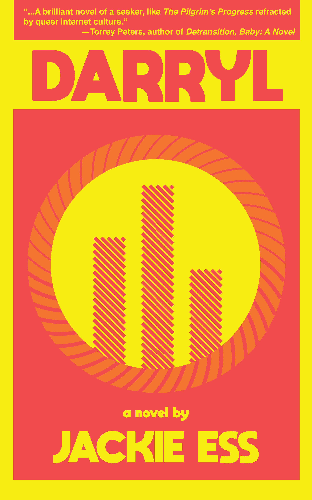
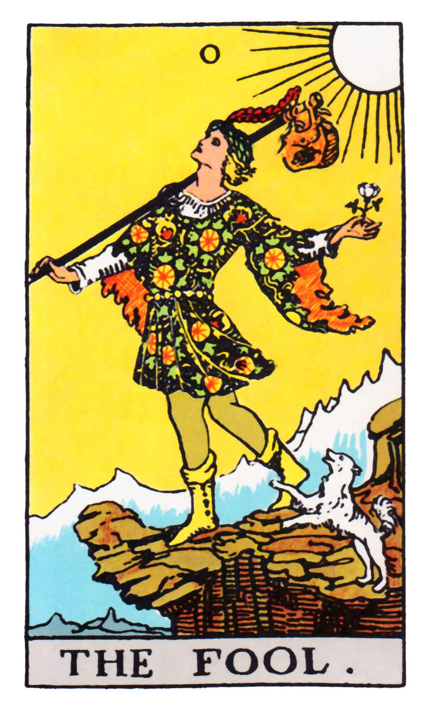
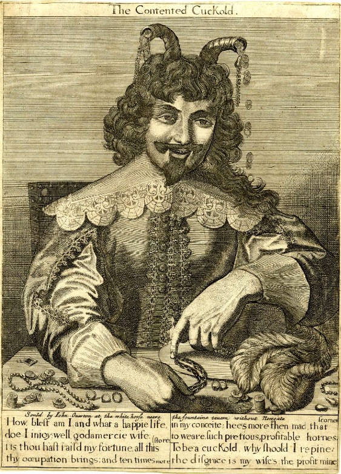

Where do I even start with this book? I honestly don't think I've ever read anything funnier. Comedy, the kind that gets you laughing til your eyes water, the kind that gives you the hiccups, is a really difficult thing to do in a novel. I think I've only read a handful of books that really nail it. So many little things have to be right for it to work, and _Darryl_ delivers the whole kit and kaboodle.

The hook, of course, is that it's the story of a cuck, but what does cuckoldry mean for Darryl? "We cuckolds", he tells his friend, Oothoon,

> are the only sexual orientation that's about the truth. Everybody else is about performance, pleasure, recognition. Is that why people seem to hate us so much lately? Maybe watching and listening are the bravest things a guy can do. Can you face your own inferiority? Can you watch yourself be replaced?

Even -- _especially_ -- when they're a bit clownish, Jackie Ess takes her characters seriously. She gives Darryl all the room in the world to make a fool of himself, but she never sneers at him, never hides behind cynicism. And it's thanks to that that we're able to glimpse what he sees, for a moment. From start to finish, there's never any doubt that what Darryl's doing matters, that he's looking for something real, even if he can't put his finger on it, that he's digging for fire. 

Darryl's narration is reflective and searching, spoken by someone still in the thick of things, mulling over events just after they've happened -- typically offstage, at the beginning of the book, though we're hurled increasingly into the present as the action escalates. His voice is earnest, vulnerable and naïve, to the point, sometimes, of being a little embarrassing. It may seem to veer close to cringe comedy, at times, but the book has a way of remaining warm and scornless. And unlike cringe comedy, Darryl's humiliations invite us in. They disarm us. He might not always know what's going on, within or without, but we find ourselves trusting him. His meditative moments intensify the action, deepening its meaning and mystery. These are real stakes he's playing for. This isn't bumper bowling, as he says, somewhere. The questions he's asking are real. 

"What connects my life to life?" Darryl often asks himself, for instance,

> the old protein machine from soup to present. Maybe what I like so much about being in nature sometimes is seeing this level where it's all automatic. Does that make any sense? It's confirming and it's relaxing. There's a feeling of being left behind by all of it. By people too. It's intense, humiliating, and kind of numb. I think I must not be wired right. Well, I know that. 
> 
> But Bill and Mindy don't really need me, right? That's the joke. But the other puzzle is this. Why can't I seem to move past this moment where everything is revealed, confirmed, the precise moment when we break the connection? The door, which was open a crack, closing. The rotary dial phone, clattering to the floor. My wife, lost to the brute. And I'm lost too, in this kind of ecstasy of shame that takes me out of myself, and deeper into this kind of ocean roar feeling. 

You hear echoes of this a passage throughout the book, from the rotary phone to the ocean roar, down the very last line. These seem to be the stakes of the novel. Will he ever step through the door? Will he find a way to connect with life and truth that isn't vicarious? Will he get any closer without falling to pieces and plummeting to earth? The image of water, in particular, returns again and again -- each time taking Darryl to the edge of things, to the point where his life, his manhood, his ego seems ready to dissolve. He faces death amidst a summer sun shower. He overdoses on GHB at the banks of the river. An adversarial meditation session reduces him to a glistening bead of water on the skin of a drum. Even in his own shower stall, he unravels:

> When the water hits my neck, it’s like I don’t exist. How long was I in there? I felt feminine, almost. Very neutral and beautiful and clean. Like somehow Bill had loosened up a layer of dirt on me that was Don Juan and Clint Eastwood and everything else and now it comes right off under the water. What would it be like to be clean?

Darryl is a character who will be living in your head for years. He'll be sitting there, quietly, in the corner, waving shyly now and then. The other characters in the books are ciphers, mostly, but memorable ones, and they do leave an impression. Clive, Bill, Mindy, Kit, Oothoon, Satori, Moonbeam, each of them feels intensely vivid when I list their name. Somebody once said something to me about Dickens' characters, and I think it applies here: "they might be flat, but they're vibrating extremely fast -- they're just _so much_ of what they are". The same can be said of _Darryl's_ supporting cast. 

This might not mean much to anyone who doesn't know her, and I'm pretty sure that everyone who does is probably already gearing up to read this book, if they haven't already, but _there's so much of Jackie in this book!_ And a lot of what makes Jackie such good company is what makes this book a good read, as well -- her sense of humour, her searching seriousness, and the brilliance that comes through in just about everything she touches.

So, go and read this book. It's going to absolutely delight you. You'll probably tear through it in a day or two, and you'll fight yourself to put it down. You'll be late for meetings. When you're in the middle of something else entirely, you'll think of some scene or another and start giggling. You'll guffaw. This book will remind you what novels can do. And when you go back for seconds, it'll be even better than you remembered, like last night's soup.

_Darryl_ hits the bookstore shelves in May. You can pre-order a copy  from CLASH Books, [HERE](https://www.clashbooks.com/new-products-2/jackie-ess-darryl-preorder) [(Archived)](https://web.archive.org/web/20220106/https://www.clashbooks.com/new-products-2/jackie-ess-darryl-preorder). You can, and you should.
